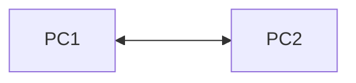
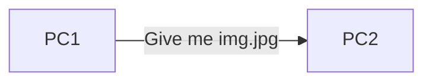
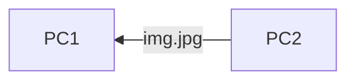
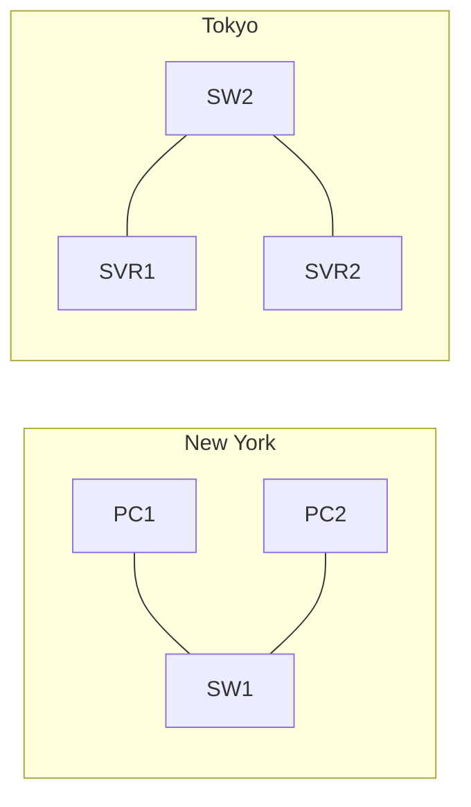
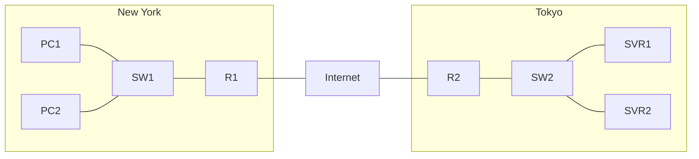
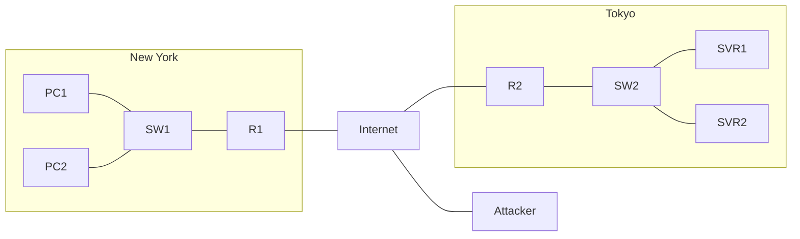
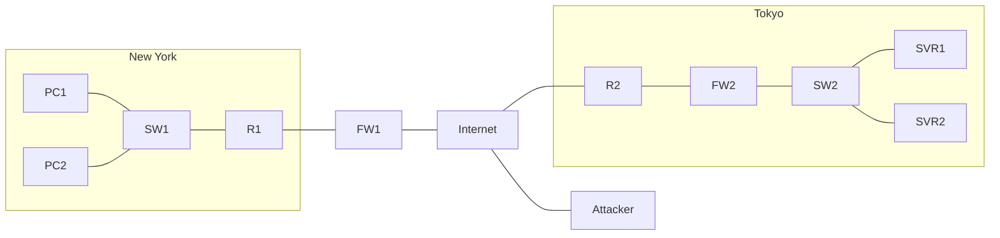

## Building a network

A computer network is a digital telecommunications network which allows **nodes** to share resources

### Client
A client can be a laptop, desktop, phone, etc.

A client is a device that accesses a service made by a server

### Server

A server is a device that provides functions or services for clients

### Switches

### Properties of switches
- Switches only operate over **LAN**
- Switches do not connect over the internet
- have many ports/interfaces for end hosts to connect to

## Router

### Properties of routers
- Routers usually have less interfaces/ports compared to switches
- Routers provide connectivity **between** LANS
- therefore routers send data over the internet

## Firewall
Consider the following Diagram:

In this example, there is an attacker on the internet. We protect our network with a **Firewall**:

Firewalls are specialty devices which protect our LAN

Firewalls can be **external** to the LAN, as with FW1, or they can be **internal** to the LAN, as with FW2

Firewalls have **security rules** which must be configured. In this case, we would allow traffic from the tokyo branch, but not from the attacker.  

### Features of firewalls
- monitor and control network traffic based on rules
- can be 'inside' or 'outside' the network. Sometimes you may have both
- Firewalls with more advanced capabilities are known as 'next gen firewalls'. More on this in a later section.
... what about the firewall on your computer?

### Network vs host based firewalls
Network firewalls are appliances which filter traffic between networks, but most computers have a built in firewall called a 'host based firewall'. This is a software application which can filter traffic just to and from your host.