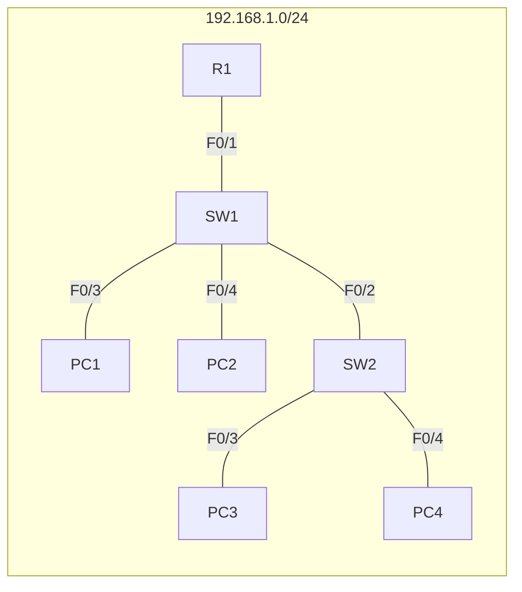
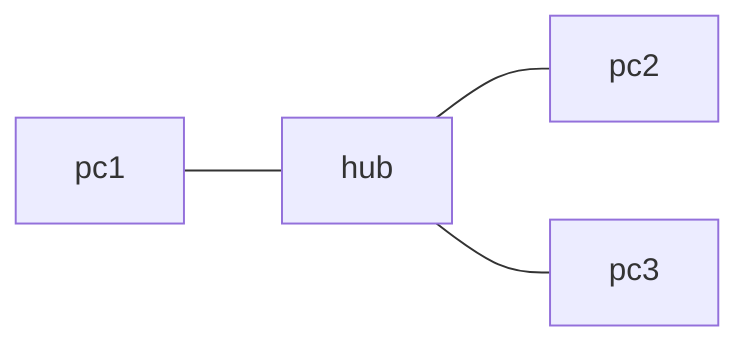
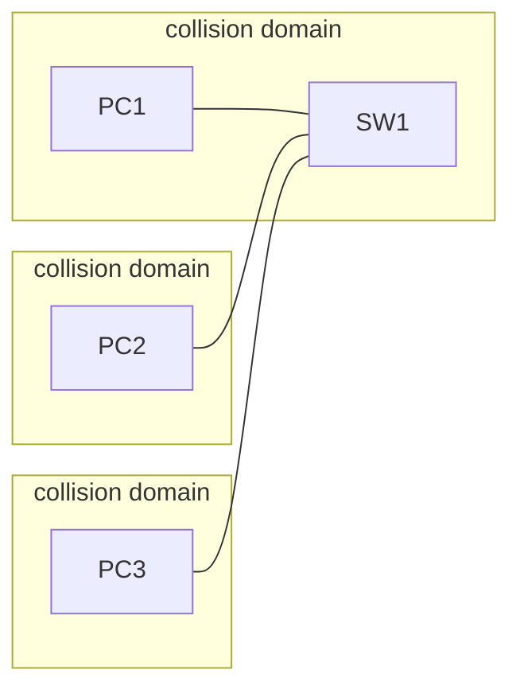

## Network Topology
For this lesson, we will use the following topology:

R1 is .254
PC1 is .1
PC2 is .2
PC3 is .3
PC4 is .4

## Configuring a switch interface
First, lets jump into the switch interface. use **en** to enter exec mode and **sh ip int br** to see an overview of the interfaces. 

```
Switch#sho ip interface brief
Interface IP-Address OK? Method Status Protocol
FastEthernet0/1 unassigned YES manual up up
FastEthernet0/2 unassigned YES manual up up
FastEthernet0/3 unassigned YES manual down down
FastEthernet0/4 unassigned YES manual down down
FastEthernet0/5 unassigned YES manual down down
FastEthernet0/6 unassigned YES manual down down
FastEthernet0/7 unassigned YES manual down down
FastEthernet0/8 unassigned YES manual down down
FastEthernet0/9 unassigned YES manual down down
FastEthernet0/10 unassigned YES manual down down
FastEthernet0/11 unassigned YES manual down down
FastEthernet0/12 unassigned YES manual down down
FastEthernet0/13 unassigned YES manual down down
FastEthernet0/14 unassigned YES manual down down
FastEthernet0/15 unassigned YES manual down down
FastEthernet0/16 unassigned YES manual down down
FastEthernet0/17 unassigned YES manual down down
FastEthernet0/18 unassigned YES manual down down
FastEthernet0/19 unassigned YES manual down down
FastEthernet0/20 unassigned YES manual down down
FastEthernet0/21 unassigned YES manual down down
```

Note that we have 2 interfaces connected to devices. These devices are up/up. These interfaces are up with no configuration. This is a big difference between routers and switches with cisco. Cisco router interfaces are administratively down by default, switches are automatically up. These switch ports don't have IP addresses, because they live on layer 2 only. 
These other interfaces aren't connected to other devices, so they are down/down. Note that this is not the same as a routers "administratively down"

### show interfaces status
Here is another nice way to check the status of an interface:
```
Switch#show int status
Port Name Status Vlan Duplex Speed Type
Fa0/1 connected 1 auto auto 10/100BaseTX
Fa0/2 connected 1 auto auto 10/100BaseTX
Fa0/3 connected 1 auto auto 10/100BaseTX
Fa0/4 notconnect 1 auto auto 10/100BaseTX
Fa0/5 notconnect 1 auto auto 10/100BaseTX
Fa0/6 notconnect 1 auto auto 10/100BaseTX
Fa0/7 notconnect 1 auto auto 10/100BaseTX
Fa0/8 notconnect 1 auto auto 10/100BaseTX
Fa0/9 notconnect 1 auto auto 10/100BaseTX
Fa0/10 notconnect 1 auto auto 10/100BaseTX
Fa0/11 notconnect 1 auto auto 10/100BaseTX
Fa0/12 notconnect 1 auto auto 10/100BaseTX
Fa0/13 notconnect 1 auto auto 10/100BaseTX
Fa0/14 notconnect 1 auto auto 10/100BaseTX
Fa0/15 notconnect 1 auto auto 10/100BaseTX
Fa0/16 notconnect 1 auto auto 10/100BaseTX
Fa0/17 notconnect 1 auto auto 10/100BaseTX
Fa0/18 notconnect 1 auto auto 10/100BaseTX
Fa0/19 notconnect 1 auto auto 10/100BaseTX
```

### Interface Speed & Duplex
Note the duplex field, this determines if a device can **send and recieve at the same time**, which is **full duplex**, or only alternating, which is **half duplex**
#### Speed & duplex auto-negotiation
Most of the time, auto-negotiation works well and you won't configure it, but lets do it for practice.

Enter the switch and use **conf t** to enter config mode. Select the interface you want to work on.  **int f0/1**
We use **speed ?** to see the options available with the speed command:
```
Switch(config-if)#speed ?
 10 Force 10 Mbps operation
 100 Force 100 Mbps operation
 auto Enable AUTO speed configuration
```
note that we can change the speed to 10, 100, or auto in this case. The same is true for duplex:
```
Switch(config-if)#duplex ?
 auto Enable AUTO duplex configuration
 full Force full duplex operation
 half Force half-duplex operation
```
##### Full and Half Duplex
- Half duplex: the device cannot send and recieve at the same time. If it is recieving a frame, it must wait before sending a frame
- Full duplex: the device can receive and send data at the same time.

obviously, full duplex is superior. In modern network, half duplex is rarely used.
##### Mechanics of speed and duplex auto-negotiation
- interfaces that can run at different speeds (10/100 or 10/100/1000) have a default setting of **speed auto** and **duplex auto**
- interfaces 'adverties' their capabilities to the neighboring device, and they negotiate the best speed and duplex setting they are both capable of
###### What if autonegotiation is disabled on the device connected to the switch?
- **speed** the switch will try to figure out the speed the other device is operating at. If it fails, it will default to the slowest possible speed
- **duplex** if at 10 or 100, it will default to half duplex. Greater wil be full duplex
### Collision Domains
#### LAN hub
to demonstrate this, we introduce a new type of network device: the lan hub. Consider the following diagram:

unlike a switch, which can forward packets, a hub is only a repeater. Any frame it recieves, it floods to all interfaces. If PC1 wants to send a frame to PC2, the hub will also send that frame to PC3.
Now, what if PC1 and PC2 want to send a frame at the same time? They both send the frames and hit the hub at the same time. Now, we have a problem. The hub isn't smart enough to wait, so it will try to flood both. The packets will collide on PC2's interface and it won't recieve either packet. PC's connected to a hub are on whats known as a **collision domain**.

Lets talk about how to avoid packet conflicts in a half duplex situation like this.
#### CSMA/CD
- Carrier Sense Multiple Access with Collsion Detection
- Before sending frames, devices listen to the collision domain until they detect that other devices are not sending
- if a collision does occur, the device sends a jamming signal to inform the other devices that a collision happened
- each device then waits a random period of time before sending frames again.
- the process repeats
#### Switches vs Hubs
Switches are a lot smarter then hubs. a switch intelligently forwards frames and only floods as necessary. a switch diagram looks more like below

As you can see, these PC's are now in seperate collision domains. Collisions are rare in this configuration and usually the sign of a misconfiguration

### Interface Status
#### Working with ranges
though they are set to on by default, really you should disable switch interfaces that are not in use, as they are a security risk. Luckily, there is an easy way to do this.
When you want to configure a range of interfaces and save a lot of time, you can use **interface rang f0/5 - 12**. then you can run the command you wish on those interfaces
```
Switch(config)#int range f0/3 - 24
Switch(config-if-range)#shutdown
%LINK-5-CHANGED: Interface FastEthernet0/3, changed state to administratively down
%LINK-5-CHANGED: Interface FastEthernet0/4, changed state to administratively down
%LINK-5-CHANGED: Interface FastEthernet0/5, changed state to administratively down
%LINK-5-CHANGED: Interface FastEthernet0/6, changed state to administratively down
%LINK-5-CHANGED: Interface FastEthernet0/7, changed state to administratively down
%LINK-5-CHANGED: Interface FastEthernet0/8, changed state to administratively down
%LINK-5-CHANGED: Interface FastEthernet0/9, changed state to administratively down
%LINK-5-CHANGED: Interface FastEthernet0/10, changed state to administratively down
%LINK-5-CHANGED: Interface FastEthernet0/11, changed state to administratively down
%LINK-5-CHANGED: Interface FastEthernet0/12, changed state to administratively down
%LINK-5-CHANGED: Interface FastEthernet0/13, changed state to administratively down
%LINK-5-CHANGED: Interface FastEthernet0/14, changed state to administratively down
%LINK-5-CHANGED: Interface FastEthernet0/15, changed state to administratively down
%LINK-5-CHANGED: Interface FastEthernet0/16, changed state to administratively down
%LINK-5-CHANGED: Interface FastEthernet0/17, changed state to administratively down
%LINK-5-CHANGED: Interface FastEthernet0/18, changed state to administratively down
%LINK-5-CHANGED: Interface FastEthernet0/19, changed state to administratively down
%LINK-5-CHANGED: Interface FastEthernet0/20, changed state to administratively down
%LINK-5-CHANGED: Interface FastEthernet0/21, changed state to administratively down
%LINK-5-CHANGED: Interface FastEthernet0/22, changed state to administratively down
%LINK-5-CHANGED: Interface FastEthernet0/23, changed state to administratively down
%LINK-5-CHANGED: Interface FastEthernet0/24, changed state to administratively down
```
#### Interface counters & errors
use **sh int** to see the interface status and potentially some errors.

There are many counters shown. Here are what you can see
- total packets
- runts = packets below minimum size
- giants = packets that are too large
- CRC = packets that failed crc check
- Frame = illegal frames
- input errors = total errors
- output errors = failed to send due to error