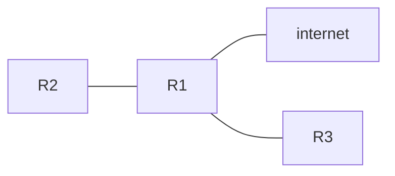

## The Topology

![[Screenshot_2.png]]
For this lesson, we will use the above topology. We start by setting the ip addresses for the interfaces on R2. Remember that if an interface is disabled, it won't appear in the routing table. 

## Review: Connected and Local Routes
Lets take a look at the routing table on R2:
![[Pasted image 20230311131046.png]]
as expected, there are 2 routes for each interface, one **connected** and one **local**. To summarize, **R2 knows how to reach destinations in connected networks and itself, but doesn't know how to reach remote networks**. It only knows how to reach **192.168.12.0/24** and **192.168.24.0/24** but none of the other destinations. If it receives a packet bound for **192.168.4.0/24** it will have to drop it. How do we remedy this situation?

## Intro to static routes
### Default Gateway
Lets take a look at how we can configure this network to allow PC1 and PC4 to communicate. PC1 and PC4's interfaces are both known as **eth0**.
- end hosts like PC1 and PC4 can send packets directly to destinations in their connected network.
	- PC1 is connected to 192.168.1.0/24, PC4 is connected to 192.168.4.0/24
- to send packets to destinations outside of a local network, they must send packets to their **default gateway**
- PC1s config looks like this
```
iface eth0 inet static
		address 192.168.1.10/24
		gateway 192.168.1.1
```
- PC4's config looks like this
```
iface eth0 inet static
		address 192.168.4.10/24
		gateway 192.168.4.1
```
- to send packets outside of the local network, it must send those packets to the gateway
- the **default gateway** can also be called a **default route**
	- it is a route to 0.0.0.0/0 = all netmask bits to set to 0. includes all addresses from 0.0.0.0 to 255.255.255.255
- The **default route** is the *least specific route possible*. it includes all possible IP addresses.
- a /32 route is the **most specific route possible**. it is only 1 IP address.
### Layer 2 and Layer 3 interactions
Lets now imagine that PC1 wants to send a packet to PC4. The src and dst IP in the L3 header looks like this:
```
Src. IP: 192.168.1.10
Dst. IP: 192.168.4.10
```
What will the dst MAC be? Because this dst has to be routed via the default gateway, the dst MAC will be the MAC of the gateway, **not** of PC4
```
Src. IP: 192.168.1.10
Dst. IP: 192.168.4.10
Dst. MAC: R1 G0/2 MAC
Src. MAC PC1 eth0 MAC
```
#### Routing Packets
- When R1 recieves this frame, it will de-encapsulate it, removing the L2 header and trailer and look at the inside packet. 
- It will then check the routing table for the most specific route. 
- unfortunately, for now, R1 only has **connected and local** routes. It can't forward this packet properly, so it will drop it.
	- Remember, routes are instructions: to send a packet to dest in network x, forward to next-hop y
- There are 2 possible paths to the destination network, one via R3 and one via R2
	1. PC1 --> R1 --> R3 --> R4 --> PC4
	2. PC1 --> R1 --> R2 --> R4 --> PC4
- for this example, we will use the path via R3
- it is possible to configure routers to:
	- load balance paths
	- use one path as main and one as backup
## Static Route Configuration
- To ensure PC1 and PC4 can communicate, each router needs **two** routes, one route to PC1 and one to PC4
	- this ensures **two-way reachability** (PC1 can send packets to PC4, PC4 can send packets to PC1)
- R1 already has a **connected** route to 192.168.1.0/24. R4 already has a **connected** route to 192.168.4.0/24.
	- other routes must be manually configured (using **static routes**)

Consider the chart below:
| Router | Destination    | Next Hop        |
| ------ | -------------- | --------------- |
| R1     | 192.168.1.0/24 | Connected       |
| R1     | 192.168.4.0/24 | 192.168.13.3/24 |
| R3     | 192.168.1.0/24 | 192.168.13.1/24 |
| R3     | 192.168.4.0/24 | 192.168.34.4/24 |
| R4     | 192.168.1.0/24 | 192.168.34.3/24                |
| R4     | 192.168.4.0/24 | Connected       |
This chart shows how each router will forward packets to get to each network.

Lets start configuring some static routes:
### Static route configuration (R1)
From global config mode:
**ip route ip-address netmask next-hop**
so, to configure the first hop to PC4:
**ip route 192.168.4.0 255.255.255.0 192.168.13.3**
You will now have a static route in the table labeled **S**
### Static route configuration (R3)
The format of the command is the same:
**ip route 192.168.1.0 255.255.255.0 192.168.13.1**
**ip route 192.168.4.0 255.255.255.0 192.168.34.4**
Should do it.
### Static Route Configuration (R4)
**ip route 192.168.1.0 255.255.255.0 192.168.34.3**

### Route config with exit-interface (R2)
Another way to configure static routes is to configure an exit interface instead of a next-hop. 
**ip route ip-address netmask exit-interface**
therefore:
**ip route 192.168.1.0 255.255.255.0 g0/0**
will send packets out of interface g0/0
You can even do both:
**ip route 192.168.1.0 255.255.255.0 g0/0 192.168.24.4**
Static routes configured with exit interface rely on a feature called **proxy-arp** to function.
This isn't usually a problem, but generally you can stick to next-hop or exit-interface next-hop
**neither is better**

## Default Routes

- a default route is a route to 0.0.0.0/0
	- this includes all possible IP addresses
- if there are no more specific routes, it will use the **default route**
- a default route is typically used to connect to the internet. 
- In the diagram, R1s **default route** would point to the internet, and other more **specific** routes would point to the other routers.
### Configuring default routes
note the following:
![[Pasted image 20230311135638.png]]
The highlighted text means there is no default route.
We can use the command:
**ip route 0.0.0.0 0.0.0.0 203.0.113.2**
to add a default route
the default route will be marked with **S\****
