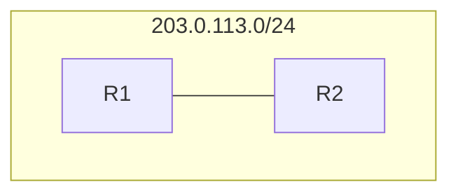
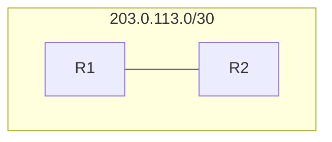

## IPv4 Classes Review
First, Lets review these classes of IP addresses:
| class | First octet | First Octet Numeric Range | range                       |
| ----- | ----------- | ------------------------- | --------------------------- |
| A     | 0xxxxxxx    | 0-127                     | 0.0.0.0 - 127.255.255.255   |
| B     | 10xxxxxx    | 128-191                   | 128.0.0.0 - 191.255.255.255 |
| C     | 110xxxxx    | 192-223                   | 192.0.0.0 - 223.255.255.255 |
| D     | 1110xxxx    | 224-239                   | 224.0.0.0 - 239.255.255.255 |
| E     | 1111xxxx    | 240-255                   | 240.0.0.0 - 255.255.255.255 | 
However, only the class A, B, and C addresses can be assigned to a device, as classes D and E have special purposes. Lets take another look at the below chart for A, B, and C:
| Class | First Octet | First Octet Numeric Range | Prefix Length |
| ----- | ----------- | ------------------------- | ------------- |
| A     | 0xxxxxxx    | 0-127                     | /8            |
| B     | 10xxxxxx    | 128-191                   | /16           |
| C     | 110xxxxx    | 192-223                   | /24           |
Remember that **prefix lengths** are used to identify which bits identify the network portion, and which identify the host portion. Therefore, in a class A address, the **first 8 bits** are used to identify the **network** portion of the IP address.
| class   | Leading bits | Size of **Network Number** bit field | size of **rest** bit field | number of networks  | addresses per network |
| ------- | ------------ | ------------------------------------ | -------------------------- | ------------------- | --------------------- |
| Class A | 0            | 8                                    | 24                         | 128(${2^7}$)        | 16,777,216($2^{24}$)  |
| Class B | 10           | 16                                   | 16                         | 16,384($2^{14}$)    | 65,536($2^{16}$)      |
| Class C | 110          | 24                                   | 8                          | 2,097,152($2^{21}$) | 256($2^8$)            |
This property gives different characteristics to these classes. Because only the first octet of a class A network is used for networking, it has only a small amount of possible networks, but a large amount of hosts, as shown in the table above. This pattern holds through different IP classes. 
### How does a company get their own IP addresses to use?
- The IANA (Internet Assigned Numbers Authority) Assigns IPv4 addreses/networks to companies based on their size
- For example, a very large company may recieve a **class A** or **class B** network, while a small company might recieve a **class C** network
- This system turned out to be inefficient and led to many wasted IP addresses.
#### An Example of IP Waste
Imagine two routers, R1 and R2. Lets imagine both have three LANS connected. Each of these routers actually needs **three address spaces**, one for each LAN and one to connect the routers together. This is known as a **point to point** network. Because this is a point to point connection, we don't need a large address block, so we assign this connection the address space of 203.0.113.0/24. 
- this is a class C network, so it has 256 available addresses
- -1 for the network address 203.0.113.0
- -1 for the broadcast address 203.0.113.255
- -1 for R1's address 203.0.113.1
- -1 for R2's address 203.0.113.2
Thats a total of 4 used addresses and **252 wasted addresses**
#### Another example
- A company X needs IP addressing for 5000 end hosts.
- A class C network does not providce enough addresses, so a class B network must be assigned
- This will result in about **60000 wasted addresses**
## CIDR (Classless Inter-domain Routing)
- When the internet was first created, the creators did not predict how large the internet would become
- **this resulted in a lot of wasted IP addresses**
- IP address exhaustion is now a big problem. TO remedy this, the IETF (Internet Engineering Task Force) introduced CIDR in 1992 to replace the 'classful' addressing system
- With CIDR, the requirements of
	- Class A = /8
	- Class B = /16
	- Class C = /24
**Were removed!**
- This allows larger networks to be split into smaller networks for greater efficiency.
- these smaller networks are called **subnetworks** or **subnets**
### The Process of Subnetting

Here is the same example we looked at earlier. This addressing scheme results in **252 wasted IP addresses**.
Lets take a closer look at this addressing scheme :
| Type        | Notation       | First Octet | Second Octet | Third Octet | Fourth Octet |
| ----------- | -------------- | ----------- | ------------ | ----------- | ------------ |
| IP address  | Binary         | 11001011    | 00000000     | 01110001    | 00000000     |
| IP address  | Dotted Decimal | 203         | 0            | 113         | 0            |
| Subnet Mask | Binary         | 11111111    | 1111111      | 1111111     | 00000000     |
| Subnet Mask | Dotted Decimal | 255         | 255          | 255         | 0            | 
There are $2^8-2$ usable addresses in this network scheme, but we only need 2, one for R1 and one for R2. Thanks to CIDR, we don't need to use /24 any more. Lets do some calculation:
- 203.0.113.0/25 = total 128 = usable 126
- 203.0.113.0/26 = total 64 = usable 62
- 203.0.113.0/27 = total 32 = usable 30
- 203.0.113.0/28 = total 16 = usable 14
- 203.0.113.0/29 = total 8 = usable 6
- 203.0.113.0/30 = total 4 = usable 2
- **203.0.113.0/31 = total 2**
- **203.0.113.0/32 = total 1**
Notice each step on the CIDR table is equal to **double or half** the next or previous step. These are all the possible addressing schemes between /24 and the final /32.
Also notice /32 and /31 are highlighted. These prefixes are special, we will discuss this later.
Based on our calculations, it seems /30 is ideal for this application, because there will be **no wasted addresses**

Now that we have 203.0.113.0/30, the range of possible addresses is 203.0.113.0 - 203.0.113.3
so now, the network address is 203.0.113.0 and the broadcast address is 203.0.113.3
The remaining addresses in the address block (203.0.113.4 - 203.0.113.255) are now available to be used in other subnets!
### /31 
But wait, is there a way to make this more efficient?
if we use the /31 prefix length, then there would be only 2 possible addresses. according to our formula, this would give us **0 usable addresses**. It used to not be possible to use a /31 network in this way, but for a **point to point** connection like this, it is actually possible.

now, R1 is .0 and R2 is .1.
normally this would be a problem, but in a point to point network with only 2 connected devices, we don't need a network IP or a broadcast IP. This means we can save even more addresses, using a perfect 2 addresses. Many people still use /30 masks for point to point connections, but it is possible to use /31 and it is more efficient. 
### /32
/32 on the other hand is special. It has only one possible address, and you will probably never use it outside of routing.
### A Helpful Chart 
| Dotted Decimal  | CIDR notation |
| --------------- | ------------- |
| 255.255.255.128 | /25           |
| 255.255.255.192 | /26           |
| 255.255.255.224 | /27           |
| 255.255.255.240 | /28           |
| 255.255.255.248 | /29           |
| 255.255.255.252 | /30           |
| 255.255.255.254 | /31           |
| 255.255.255.255 | /32              |
