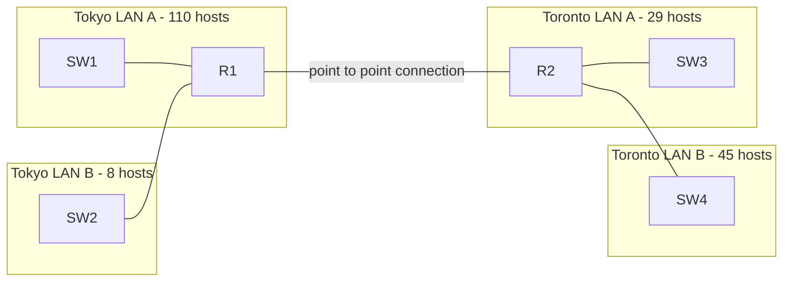

## Subnetting Class A networks

Remember that the process of subnetting class A, B, and C networks are exactly the same!

Q1. You have been given the 10.0.0.0/8 network. You must create 2000 subnets which will be distributed to various enterprises
what prefix length will you use?
How many host addresses (usable) will be in each subnet?

A. 10.0.0.0/19, 2^13 addresses per subnet, 8190 usable hosts

Q2. PC1 has an IP address of 10.217.182.223/11
Identify the following for PC1's subnet:
1) Network Address:10.192.0.0/11
2) Broadcast Address:10.223.255.255/11
3) First Usable Address:10.192.0.1/11
4) Last Usable Address:10.223.255.254/11
5) Number of host (usable) addresses:2097150
| 128 | 64  | 32  | 16  | 8   | 4   | 2   | 1   |
| --- | --- | --- | --- | --- | --- | --- | --- |
| 1   | 1   | 0   | 1   | 1   | 0   | 0   | 1   |
| N   | N   | N   | H   | H   | H   | H   | H   |
## VLSM (Variable Length Subnet Masks)
- Until now, we have practived subnetting using FLSM (Fixed-Length Subnet Masks)
- This means that all subnets used the same prefix length (ie. subnetting a class C network into 4 subnets using /26)
- VLSM is the process of creating subnets of different sizes, to make your use of network addresses more efficient
- VLSM is more complicated than FLSM, but its easy if you follow the steps correctly.
Consider the following diagram:

When assiging VSLM subnets, assign the largest subnet first, and work your way to the smallest. 

we are assigned the 192.168.1.0/24 network, and must divide it into 5 subnets to allow all hosts to get on the network. Rather then dividing it evenly, we can do it like this, in order of most to least:
Tokyo LAN A = .0/25
Toronto LAN B = .128/26
Toronto LAN A = .192/27
Tokyo LAN B = .224/28
Point-to-point = .240/30-

LAN2 .0/25
LAN1 .128/26
LAN3 .192/28
LAN4 .208/28
Point-to-point: .224/30