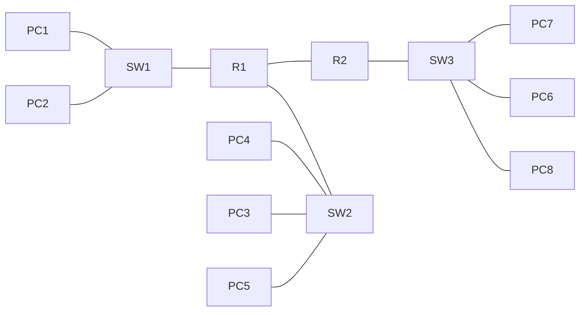
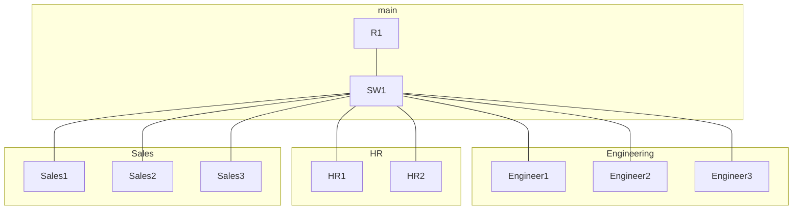

## What is a LAN?
- Previously, we said a LAN is a group of devices (PCs, Servers, routers, switches, etc) in a single location (home, office, etc)
- Heres a mor specific definition: a LAN is a single **broadcast domain**, including all devices in that broadcast domain
- a **broadcast domain** is the group of devices which will recieve a broadcast fram (Dst MAC FF:FF:FF:FF:FF:FF) sent by any of the members
### Broadcast Domains
Consider the below diagram:

How many broadcast domains are there? 
The answer is **four**, because routers don't forward broadcast frames. Note however, this means that the NIC on the router is still attached to each LAN.
The fourth domain can be hard to spot. It exists between **R1 and R2**
## What is a VLAN (Virtual Local Area Network)
Lets say we have a small company with three different departments: Engineering, HR, and Sales:

We have a 192.168.1.0/24 set up for this LAN. However, this is not the best set up for both efficiency and security reasons. For example, if an engineering PC sends a broadcast frame, it will be sent to all PC's in the broadcast domain, including those in other departments. This can reduce network performance.
As for security, even within the same office, not everyone should have access to everything. You can apply security policies on a router/firewall. Because this is one LAN, the PC's can reach each other directly without passing through the router. So, even if you configure security policies, it won't have any effect.
Instead, we can split up our departments into subnets:
192.168.1.0/26 for engineering
192.168.1.64/26 for HR
192.168.1.128/26 for Sales
now we have another problem. The router will need an IP address for each subnet, so we need to replace the single connection with three seperate connections to R1. 
There is yet another problem. Although we have seperate the devices on Layer 3 with subnets, they are still in the same broadcast domain, because if SW1 floods, it will flood to all of its interfaces. We don't want to buy another switch, because its expensive and inefficient. 
This is where VLANS come in. Lets assign some VLANS:
VLAN10 for engineering
VLAN20 for HR
VLAN30 for sales
We assign these VLANS on the switch. With VLANS, a switch will consider each VLAN as a seperate LAN, and will broadcast unkown or unicast traffic between them. 
**the switch does not perform inter-vlan routing. The Router must do this.**
- VLANS are confgured on switches on a **per interface** basis
- **logically** seperate end hosts at layer 2
- Switches do not forward traffic directly between hosts that are VLANd
## configuring a VLAN
- use **sh vlan br** to see the current vlan table
	- the default VLAN is VLAN1, all ports will be under this to begin with
	- VLANS 1 and 1001-1005 exist by default and cannot be deleted
- use **int range** to select a range of interfaces
- use the **switchport mode access** command to set the interface as an access port
	- an access port is a switchport which belongs to a single VLAN, usually it connects to an end host like PC's
	- Switch ports which carry multiple VLANS are called 'trunk ports'
	- switch ports are usually access ports by default, but its a good idea to make sure
- the last command is **switchport access VLAN10**
	- this command assigns the vlan to the port
	- if the vlan does not exist, it will be created. 
- to edit VLANS, you can use the **vlan 10** command
	- then you can assign a name using **name engineering**