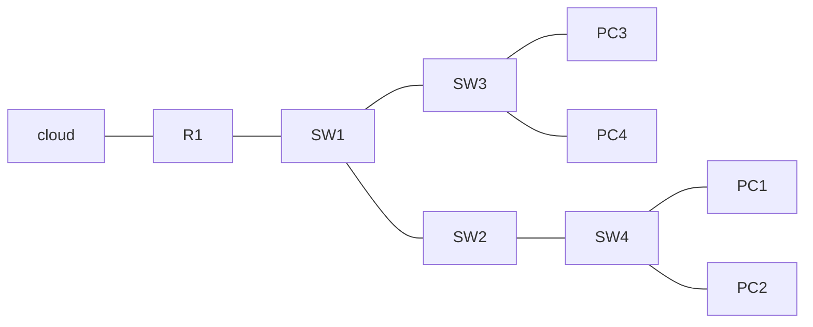
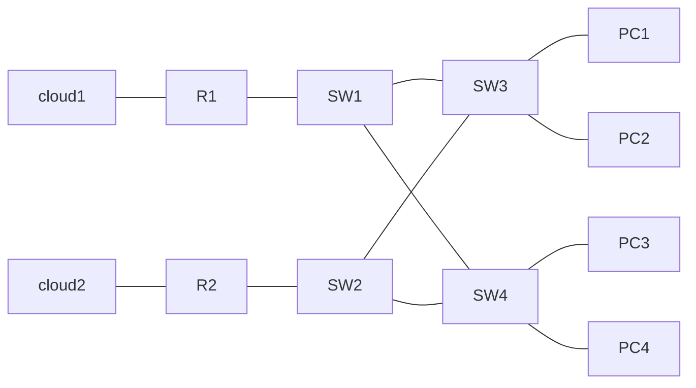
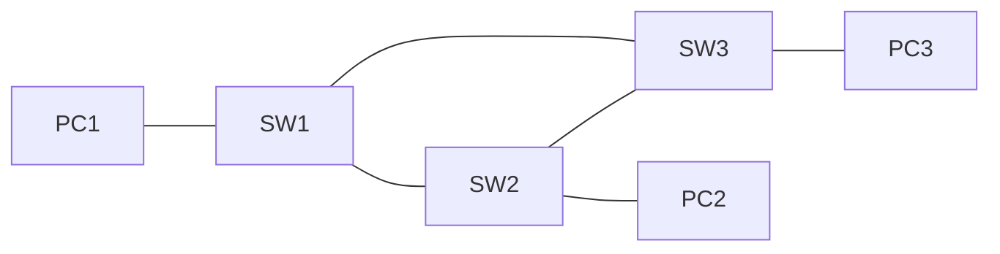

## Network Redundancy
- redundancy is an essential part of network design
- Modern networks are expected to run 24/7/365. Even short amounts of downtime can be disastrous for a business. 
- if one network component failes, you must ensure that other components will take over with little or no downtime
- as much as possible you must implement redundancy at all levels to ensure there is no single point of failure
### A poorly designed network

Take a look at the network above. If the single cloud connection is cut, the entire network loses connectivity to the internet, or if SW3 goes down, PC3 and PC4 will lose connection
### An improved network

Here, even if one router goes down completely, the Clients can still reach the internet., and if SW1 or SW2 failes, there is still a route for all clients.
Unfortunately though, most PC's only have a single NIC, so they can only be plugged into a single switch. However, important servers usually have multiple NICS for redundancy.

## Broadcast Storms
Unfortunately, there is a major problem with the above diagram. There is such a thing called a **broadcast storm**. Consider the below topology as demonstration:

Here, we have three PC's connected to a network. Lets imagine PC1 wants to send some traffic to PC2. 
1. it needs to send an ARP request frame, which is a broadcast frame.
2. SW1 recieves the frame and floods it
3. SW2 and SW3 recieve the frame, and flood it out of all interfaces except the one it was recieved on
4. Now we have a problem. SW2 and SW3 are both sending and recieveing the same broadcast frame. They Flood the frame again.
5. Now SW1 recieves the frame. It floods it back to SW2 and SW3, as well as PC1. 
This will continue forever. The TTL field is used to prevent infinite loops, but that is a **layer 3** function. These broadcast frames will loop and multiply indefinitely. Eventually the network will become too congested for legitimate traffic and cause a **broadcast storm**.
network congestion isn't the only problem. Each time a frame arrives on a switchport, the switch uses the source MAC address field to learn the MAC address and update its mac address table. When frames with the same ssource MAC address repeatedly arrive on different interfaces, the switch is forced to continously update its MAC table. This is known as **MAC address flapping**.

So how can we design a network with redundant paths without creating loops?
## Spanning Tree Protocol
- for now, we will focus on **Classic Spanning Tree Protocol** - IEEE 802.1D
- Switches from ALL vendors run STP by default
- STP prevents Layer 2 loops by placing redundany ports in a blocking state, disabling the interface
- these interfaces act as backups that can enter a forwarding state if an active (currently forwarding) interface fails
- interfaces in a forwarding state behave noramlly. They send and recieve all normal traffic.
- interfaces in a blocking state only send and recieve STP messages (Called BPDUs = Bridge Protocol Data Units)
- Below, the interface on SW2 has been put in a **blocking state**, preventing the loop. If at some point another interface fails, the switches can automatically adjust the topology and activate this interface

- by selecting which paths are **forwarding** and which are **blocking**, STP creates a single path to/from each point in the network. This prevents layer 2 loops.
- There is a set process STP uses to determine which ports should be forwarding or blocking
- STP-enabled switches send/recieve Hello BPDUs out of all interfaces. The default timer is 2 seconds (the switch will send a hello BPDU out of every interface, once every 2 seconds)
- if a switch recieves a hello BPDU on an interface, it knows that interface is connected to another switch
- The switches use these BPDU's to advertise themselves to other switches
- switches use one field in the STP BPDU, the **Bridge ID** field, to elect a **root bridge** for the network
- the switch with the lowest **bridge ID** becomes the **root bridge**
- **ALL** ports on the **root bridge** are put in a forwarding state, and other switches in the topology must have a path to reach the root bridge.
- traditionally, the Bridge ID looks like this:
| Bridge Priority | MAC address |
| --------------- | ----------- |
| 16 bits         | 48 bits            |
- the default bridge priority is 32768, so by default MAC address is used as the tie-breaker (lowest MAC address becomes the root bridge)
- The bridge ID has been updated however, now it looks like this:
| Bridge Priority | Extended System ID (VLAN ID) | MAC address |
| --------------- | ---------------------------- | ----------- |
| 4 bits          | 12 bits                      | 48 bits            |
- Cisco switches use a version of STP called PVST (Per VLAN spanning tree). PCST runs a seperate STP 'instance' in each VLAN, so in each VLAN different interfaces can be forwarding or blocking.
- in the default VLAN of 1, the default bridge priority is actually 32769
- STP bridge priority can only be changed in units of 4096. The VLAN ID will then be added to get the total bridge priority
- all interfaces on the root bridge are **designated ports** which are always in a forwarding state
- when a switch is powered on, it assumes it is the root bridge
- it only gives it up when it recieves a 'superior' BPDU
- once the topology has converged and all switches agree on the root bridge, only the root bridge sends BPDUs
- other switches in the network will forward these BPDU's, but will not generate their own original BPDUS
### Putting it all together
1. The switch with the lowest Bridge ID is elected as the **root bridge**. All ports on the root bridge are **designated ports**
	- the root bridge is the switch with the lowest **bridge ID**
2. each remaining switch will select **one** of its ports as a **root port**. the interface with the lowest **root cost** will be the root port. Root ports are also forwarding.
	1. each interface has an associated **root cost**. See the table below
| speed    | stp cost | 
| -------- | -------- | 
| 10 Mbps  | 100      | 
| 100 Mbps | 19       |     
| 1 Gbps   | 4        |     
| 10 Gbps  | 2        |     
	The root cost is the total cost of the path to get back to the bridge.
	2 . The Switch will send out BPDU's containing its root cost to that point (The root cost on a bridge is always 0)
	3. A switch will recieve it and relay it, adding the cost of it's own interface
	4. if there is multiple interfaces with the same root cost, it will choose based on **bridge ID**
	5. if the priority is the same, the lowest **MAC address** will be picked
	6. if the connections have the same MAC and same cost (as in the case of 2 switches connected to each other multiple times) the port with the lowest **neighbor Port ID** will be selected. this is equal to the port priority + the port number
3. a single port is designated for blocking based on these criteria
	1. the switch with the **highest root cost**
	2. if the root cost is the same, the switch with the highest **bridge ID** will make its port blocking
	3. the other switch will make its port designated