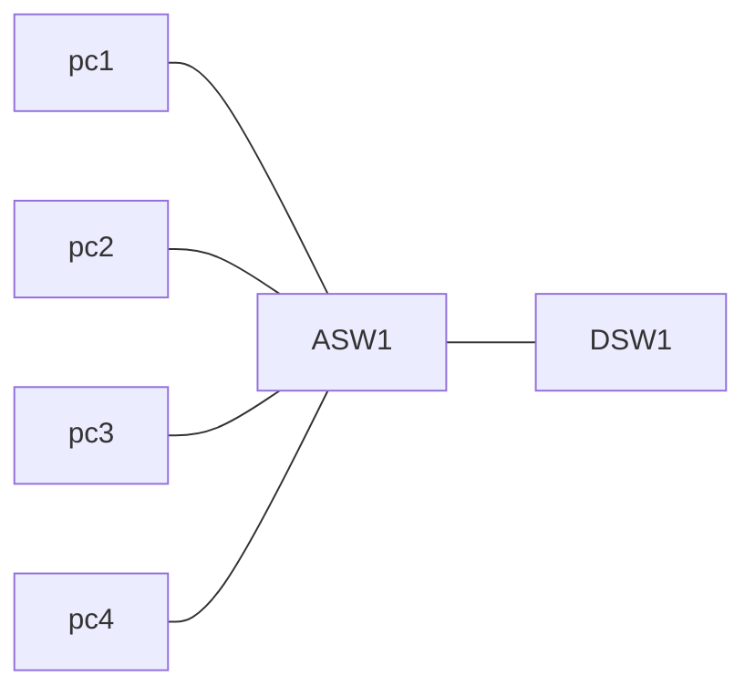
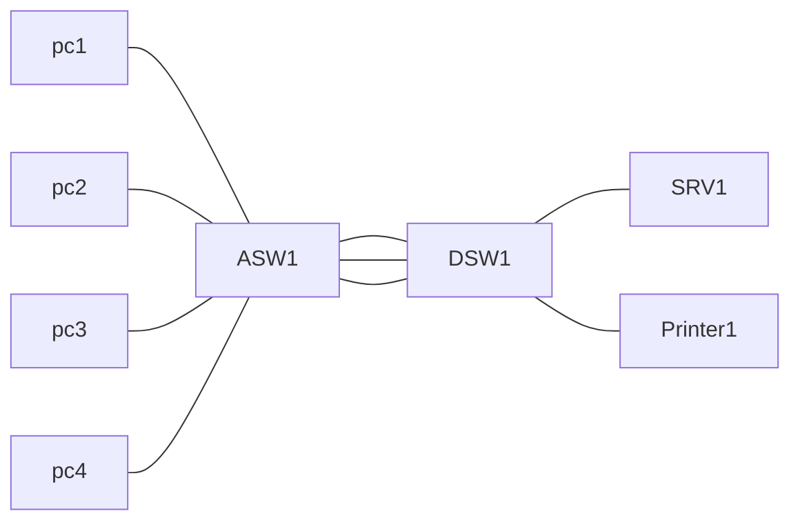

## What is Etherchannel?
### A problem to solve
first, consider the below diagram

ASW1= Access layer Switch. This is a switch that end hosts connect to 
DSW1= Distribution Layer Switch. This is a switch that access layer hosts connect to.

We have many hosts connected to ASW1, and the link between ASW1 and DSW1 is getting congested, so we should configure another link to increase the bandwith and support all of these end hosts.
Now, the network looks like this

but, the additional link doesn't seem to help. So, lets add another link!

but, this still doesn't seem to help...
When the bandwith of the interfaces connected to end hosts is greater than the bandiwth of the connection to the distribution switch(es) this is called **oversubscription**. Some oversubscription is acceptable, but too much will cause problems. 
#### Spanning tree limitations
of course, we are blocked by spanning tree.
- If you connect two switches together with multiple links, all except one will be disabled by spanning tree
- if all of ASW1's interfaces were forwarding, layer 2 loops would form between ASW1 and DSW1, causing a broadcast storm
- other links will be unused unless the active link fails.
### Enter Etherchannel
- With Etherchannel, we can form **multiple physical interfaces into one logical interface!**
- in network diagrams, etherchannel is represented by multiple interfaces with a circle around them, like this:
![[Pasted image 20230327123209.png]]
- STP will treat this group as a single interface
- Traffic using etherchannel will be load balanced among the physical interfaces in the group. an algorith is used to determine which traffice will use which physical interface. more details on this later
- some other names for an etherchannel are:
	- Port Channel
	- LAG (Link Aggregation Group)
#### Etherchannel Load Balancing
- Etherchannel load balances based on 'flows'
- a flow is a communication between two nodes in the network
- as an example, consider the following diagram:

- Lets say pc1 wants to talk to SRV1. Etherchannel will select an interface for these frames to travel down, and this is known as a 'flow'
- Frames in the same flow will be forwarded using the same physical interface
- if frames in the same flow were forwarded using different physical interfaces, frames may arrive out of order, which could cause problems
- if PC1 wants to print something and initiates a connection with Printer1, it will create a different flow, and may end up on a different interface
- you can change the inputs that are used in the interface selection. Here are the inputs that can be used
	- source MAC
	- Destination MAC
	- Source AND Destination MAC
	- Source IP
	- Destination IP
	- Source AND Destination IP
## Configuring Layer 2 and Layer 3 Etherchannel
### Creating an etherchannel between switches
there are three methods of ethercahnnel configuration on cisco switches:
#### PAGP
- PAgP (Port aggregation Portocol)
	- cisco proprietary
	- dynamicall negotiates the creation/maintenance of the etherchannel (like DTP does for trunks)
#### LACP
- LACP (Link Aggregation Control Protocol)
	- industry standard protocol (IEEE 802.3ad)
	- Dynamically negotiates the creation/maintenance of the etherchannel
	- this is the preffered method
#### Static Etherchannel
- Static Etherchannel
	- a protocol is not used to determine if an etherchannel should be formed
	- interfaces are statically configured to use etherchannel
	- this is usually avoided
- up to 8 interfaces can be formed into a single channel 
	- Actually LACP allows up to 16, but only 8 will be active. the other 8 will be in standby waiting for active interfaces to fail
### CLI configuration
- first select an interface or range
- use **show etherchannel summary** to view config
- use **channel-group 1 mode x** 
- the **1** here is used to identify which logical interface they are being assigned to
- There are 5 options to replace **x** with
	- **active** - enable LACP unconditionally
	- **auto** - enable PAgP only if a PAgP device is detected
	- **desirable** - Enable PAgP unconditionally
	- **on** - enable etherchannel only
	- **passive** - enable LACP only if a LACP device is detected
- you can select the **port-channel** as an interface and configure it as such 
- member interfaces must have matching configurations
	- same duplex
	- same speed
	- same switchport mode
	- same vlans
- if they do not match, they will be removed from the etherchannel/port-channel
- for a layer 3 etherchannel, the process is similar
- select a range of ports and use **no switchport** to enable routing mode
- then use the channel group command **channel-group 1 mode active**
- next, select the port channel interface and set an IP address **int po1**
- **ip address 10.0.0.1 255.255.255.252**
### Configuring Load-Balancing
- use **show etherchannel load-balance** to see information about the load balancing config
- to change the load balancing method use **port-channel load-balance src-dst-mac**
	- in this example it is using source and dest mac
- note the use of port-channel AND etherchannel