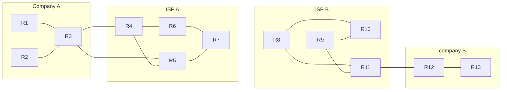
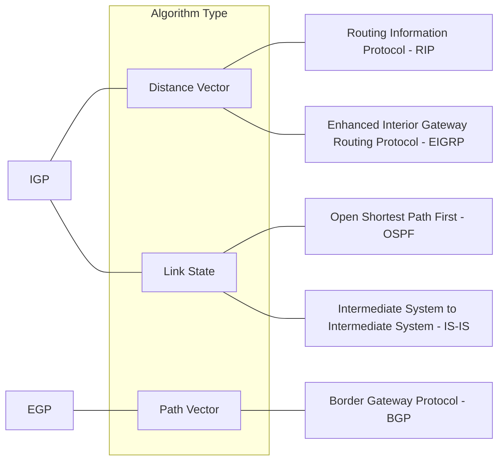

## Topology
Here is the topology for this lesson
![[Pasted image 20230329142355.png]]
Along with this, lets introduce some new terminology:
**Network Routes:** a route to a subnet with a prefix below /32
**Host Routes:** a route to a specific host, specified with /32 address
## Introduction to Dynamic Routing Protocols
Instead of configuring static routes on these routers, you can enable a **dynamic routing protocol** on them. This way, R1 will **advertise** that 192.168.4.0/24 can be reached via itself. R2 will then advertise this, and so on, with each router adding this to its route table. This continues until R3 recieves the message, and it will be the final one to add this to its routing table. 

If there is an error, and 10.0.24.2/30 goes down, these routes will be automatically removed. if this were a **static route** instead of a **dynamic route**, this will not occur, and packets will be lost to an invalid route. Now, lets make a change to this network and add a connection between R3 and R4. In this case, if a failure occurs, the routes will dynamically replace themselves with the new, valid route.
### Key Points
- routers can use dynamic routing protocols to advertise information about the routes they know to other routers
- they form **adjacencies**, **neighbor relationships**, or **neighborships** with adjacent routers to exchange this information
- if multiple routes to a destination are learned, the router determines which route is superior and adds it to the routing table. it uses the 'metric' of the route to decide which is superior
## Types of Dynamic Routing Protocols
- dynamic routing protocols have two main categories
	- **IGP**: interior gateway protocol
	- **EGP**: Exterior gateway protocol
- IGP is used to share routes **within** a single autonomous system (AS), which is a single organization (IE a company)
- EGP is used to share routes **between** different autonomous systems
consider this diagram:

Company A, ISP A, ISP B, and Company B are each their own autonomous System
- within an AS, IGP is used
- Between AS, EGP is used
- they both have the same purpose, but function differently
### IGP and EGP compared

- There is only **one** EGP protocol, it is called BGP. This course won't go into depth on BGP, but know its purpose is to help exterior gateways between autonomous systems to share route information. 
- RIP and EIGRP are the two distance vector protocols
- OSPF and IS-IS are the two Link state protocols
We will get more in depth with this later on.
### Distance Vector Routing Protocols
- **Distance Vector Protocols** were invented before link state protocols
- early examples are RIPv1 and cisco's proprietary protocol IGRP (which was updated to the EIGRP)
- Distance vector protocols operate by sending the following to their directly connected neighbors:
	- known destination networks
	- metric to reach known destination networks
- this method of sharing information is often called 'routing by rumor'
- this is because the router doesn't know about the network beyond its neighbors. It only knows the information its neighbors tell it.
- called 'distance vector' because routers only learn the 'distance' (metric) and 'vector' (direction, next hop) of each route
### Link State Routing Protocols
- When using a **link state** routing protocol, every router creates a 'connectivity map' of the network
- to allow this, each router advertises information about its interfaces (its connected networks) to its neighbors. These advertisements are passed along to other routers, until all routers in the network develop the same map of the network. 
- each router independently uses this map to calculate the best routes to each destination
- each router gets a **whole picture** of the network
- link state protocols user more resources (CPU) on the router, because more information is shared
- However, Link state protocols tend to be faster in reacting to changes in the network than distance vector protocols
## Dynamic Routing Protocol Metrics
- a routers route table contains the best route to each destination it knows about
- if a router using a dynamic protocol learns two routes to the same destination, how does it determine which is better?
- it uses the **metric** value of routes to determine which is best. A lower metric = better
- this is similar to the root cost in STP
- each routing protocol uses a different routing protocol to determine which is best. 
consider the following diagram:
![[Pasted image 20230329151058.png]]
- in this example, the route via R2 is selected. This is because R3 and R4 are using a slower connection. 
- What if R3 and R4 are also Gigabit connections?
- if a router learns two or more routes via the **same routing protocol** to the **same destination** (same network address and subnet mask) with the **same metric**, both will be added to the routing table. Traffic will be load balanced between both routes.
- OSPF routes will be denoted with an **O** marker in the routing table. the routing metric value will be displayed in brackets beside the route destination. there is also **administrative distance** displayed here. 
- When routers load balance like this, it is called **equal cost multi-path (ECMP)**
- You can also use **ECMP** with static routes. Simply configure the same route with two gateways. 
| IGP   | Metric                                          | Explanation                                                                                                                                                                 |
| ----- | ----------------------------------------------- | --------------------------------------------------------------------------------------------------------------------------------------------------------------------------- |
| RIP   | Hop Count                                       | Each router in the path counts as one 'hop'. The total metric is the total number of hops to the destination. **Links of all speed are equal**                              |
| EIGRP | Metric based on bandwith and delay (by default) | Complex formula that can take into account many values. By default the bandwith of the **slowest link in the route** and the total delay of all links in the route are used |
| OSPF  | Cost                                            | The cost of each link is calculated based on bandwidth. The total metric is the total cost of each link in the route                                                        |
| IS-IS | Cost                                            | The total cost of each link in the route. The cost of each link is **not** automatically calculated by default. All links have a cost of 10 by default                      | 

## Administrative Distance
- in most cases a company will use only a single IGP, usually OSPF oe EIGRP
- however in some rare cases they might use two. For example, if two companies connect their networks to share information, two different routing protocols might be in use
- metric is used to compare routes **learned via the same routing protocol**
- different routing protocols use totally different metrics, so they cannot be compared.
- for example, an OSPF route to 192.168.4.0/24 might have a metric of 30, while an EIGRP route to the same destination might have a metric of 33280. Which route is better? which one should the router put in the route table?
- the **administrative distance** is used to determine which routing protocol is prefered
- a lower AD is preferred, and indicates that the routing procols are more **trustworthy** and therefore more likely to select good routes.
| Route protocol/type | AD  |
| -------------------- | --- |
| Directly Connected   | 0   |
| Static               | 1   |
| external BGP         | 20  |
| EIGRP                | 90  |
| IFRP                 | 100 |
| OSPF                 | 110 |
| IS-IS                | 115 |
| RIP                  | 120 |
| EIGRP (external)     | 170 |
| Internal BGP (iBGP)  | 200 |
| Unusable Route       | 255 | 
### Floating Static Routes
- it is possible to change the AD of a static route, and make it less preferred than routes learned by a dynamic routing protocol to the same destination
- this is called a **floating static route**
- the route will be inactive (Not in the routing table) unless the route learned by the dynamic protocol is removed (for example, the remote router stops advertising it for some reason, or an interface failure causes an adjacency with a neighbor to be lost)
