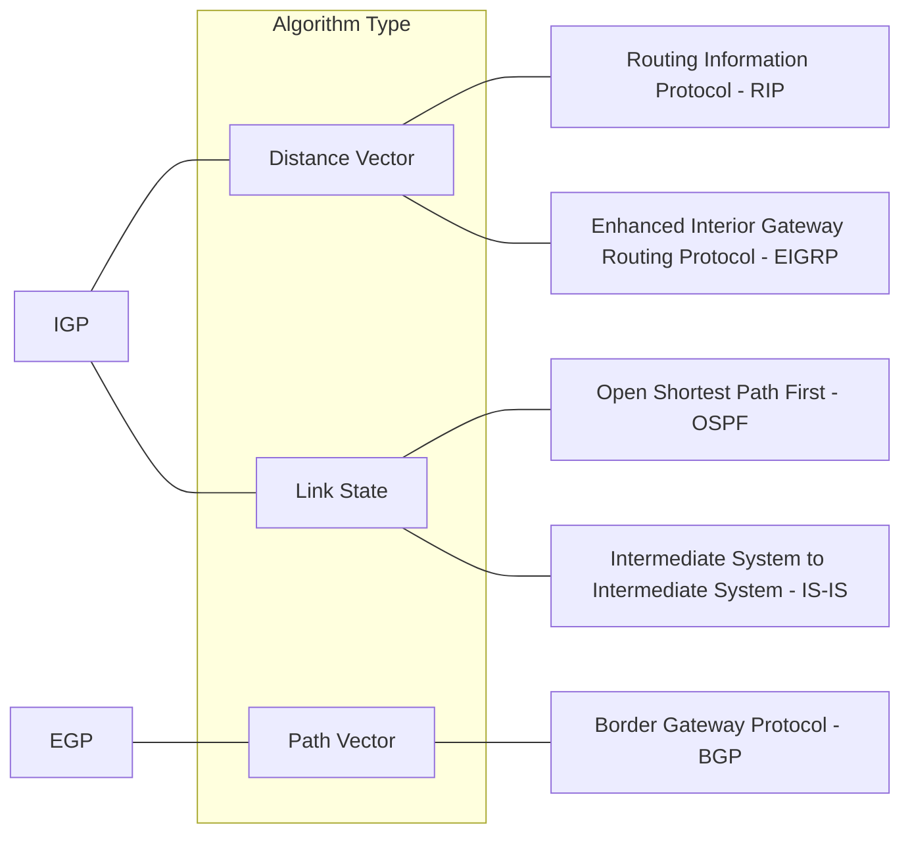
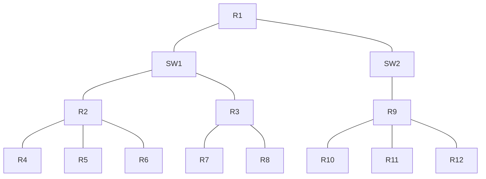
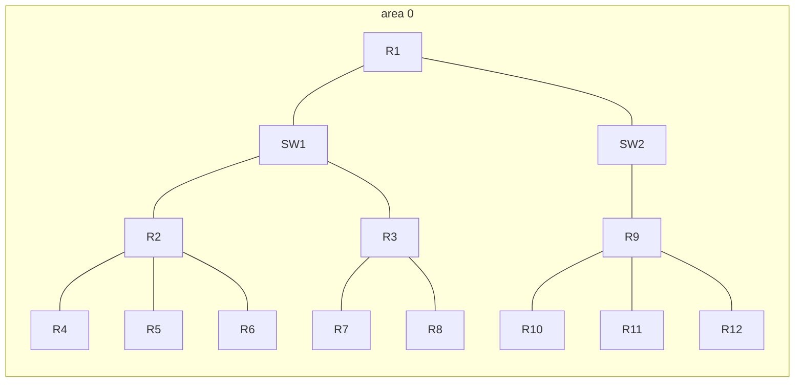
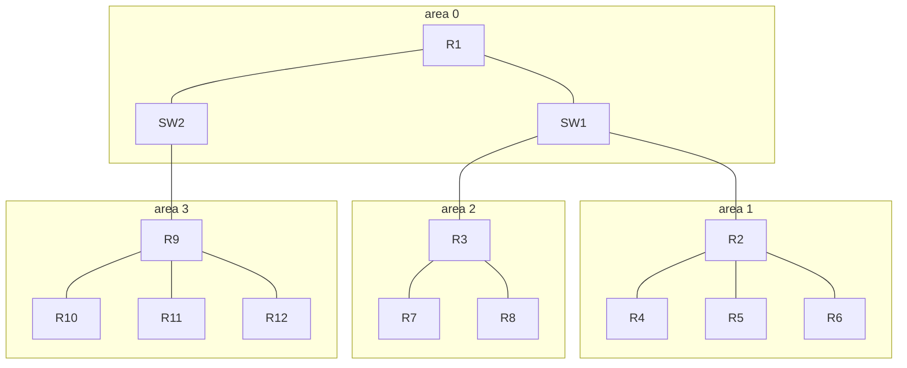

## Basic OSPF operations (Introduction)
### Types of dynamic routing protocols

Lets review this chart from an earlier section. Remember that OSPF is a **link state** routing protocol. These work differently then the distance vector routing protocols **RIP** and **EIGRP**
- **Distance vector protocols** use **routing by rumor** to determine the best routes, but they don't have a complete map of the network
- **Link state protocols** create a 'connectivity map' of the network
- each router advertises information about its interfaces to its neighbors. These advertisements are passed along to other routers, until all routers in the network develop the same map of the network
- each router independently uses this map to calculate the best routes
- link state protocols use more resources (CPU) on the router, because more information is shared
- however, link state protocols tend to be faster in reacting to changes in the network than distance vector protocols
### OSPF
- stands for **open shortest path first**
- uses the **shortest path first** algorithm of dutch computer scientist Edsger Dijkstra.
	- this is called **Dijkstras Algorithm**. Remember this, it may be a test question
- there are three versions of OSPF:
	- OSPFv1 (1989): Old and no longer used
	- OSPFv2 (1998): used for IPv4
	- OSPFv3 (2008): Used for IPv6
- Routers store information about the network in **LSAs (Link State Advertisements)** which are organized in a structure called the **LSDB (Link State Database)**
- Routers will **flood** LSAs untill all routers in the OSPF **area** develop the same map of the network
Consider the following network:
![[Pasted image 20230405121105.png]]
- All of these routers are neighbors.
- OSPF is enabled on R4's G1/0 interface
- R4 Creates an LSA to tell its neighbors about the network on G1/0
- it creates an **LSA** which looks like this:
| LSA   |                |
| ----- | -------------- |
| RID:   | 4.4.4.4        |
| IP:   | 192.168.4.0/24 |
| Cost: | 1               |
- The RID (Router ID) is either from a loopback interface or is manually configured, as none of the interfaces has an IP of 4.4.4.4
- this LSA is then flooded until all of the routers have a valid copy
- This LSA is then added to the LSDB of all the routers
- each router then uses the SPF algorithm (Shortest Path First) to calculate its best route to 192.168.4.0/24
- remember ALL routers have a **complete map** of this network
- note that each LSA has an **aging timer** of 30 minutes by default
#### OSPF steps summarized
Lets more clearly state the steps of OSPF
There are three main steps in the process of sharing LSAs and determining the best route to each destination in the network
1) **Become neighbors** with other routers connected to the same segment
2) **exchange LSAs** with neighbor routers
3) **calculate the best routes** to each destination, and insert them into the routing table

## OSPF Areas
- OSPF uses **areas** to divide up a network
- small networks can be **single-area** without negative performance
	- for example, the diagram above only has four routers. this could be a single area.
- in larger networks, a single area design can have negative effects:
	- the SPF algorithm takes more time to calculate routes
	- the algorithm requires exponentially more processing power
	- the larger LSDB takes up more memory
	- any small change in the network (ie, activating an interface) causes every router to flood LSAs and run the SPF algorithm again
- by dividing a large OSPF into smaller areas, you can avoid the above negative effects
### Basic Areas
Consider the following diagram:

This is an example of a **large network.** For simplicity, There are only 12 routers, but in reality there would be many more. 

This would be an example of a **single area** configuration. Area 0 is a special area in OSPF, it is known as the **backbone.** More on backbone areas in a bit. 

Much better to split the routers into different areas, like this. 
- An **area** is a set of routers and links that share the same LSDB
- the **backbone area** (area 0) is an area that **all other areas must connect to**
- routers with all interfaces in the **same area** this is an **internal router**. 
	- routers R10, R11, and R12 are examples of **internal routers** because all of their interfaces are within area 3
- routers with interfaces in multiple areas are called **area border routers** (ABR)
	- routers R9 and R3 are examples of **ABRs**
	- ABRs maintain a seperate LSDB for each area they connect to. it is recommended you only connect a router to a maximum of 2 different areas. 
- routers connected to the backbone area (area 0) are **backbone routers**. 
	- R1, R9, R3, and R2 are examples of **backbone routers**
- an **autonomous system border router** (ASBR) advertises a default route to other routers
- an **intra-area route** is a route to a destination inside the **same** area
- an **interarea route** is a route to a **different** area
- OSPF areas should be **contiguous**
	- Here is an example of an **illegal** set up. 

Note how area 1 is split up into 2 areas. this is **not permitted**.
- OSPF areas should have **at least 1 Backbone router**
- OSPF interfaces in the same subnet must be in the same area
## Basic Configuration
- to enter configuration mode use **router ospf num**
	- the number in this case is a process ID (PID). It doesn't actually matter which you choose. They do not have to match with other routers.
- use the network command to activate the interfaces with the described IP addresses.. In this case you need to use an area marker at the end. **network 10.0.12.0 0.0.0.3 area 0**
	- note that this uses **wildcard masks**
	- pain in the ass to be honest
- you can use the passive interface command to not send OSPF hello messages out of this interface. It will still be included in LSAs to other routers. **passive-interface G0/1 **
- to advertise a default route, it is the same as EIGRP. **default-information originate**
- use **show ip-protocols** to check which routing protocols are being used. You can check the router ID here.
- Lets quickly review Router ID priority:
	1) Manual configuration
	2) Highest IP address on loopback interface
	3) Highest IP address on physical interface
- to manually configure a router ID, from router config mode use **router-id 1.1.1.1**
	- you will then need to reload the router or use **clear ip ospf process**. The router will remind you of this. 
	- in a real network, this is a problem as it will disrupt the network. In a lab there is no problem.
