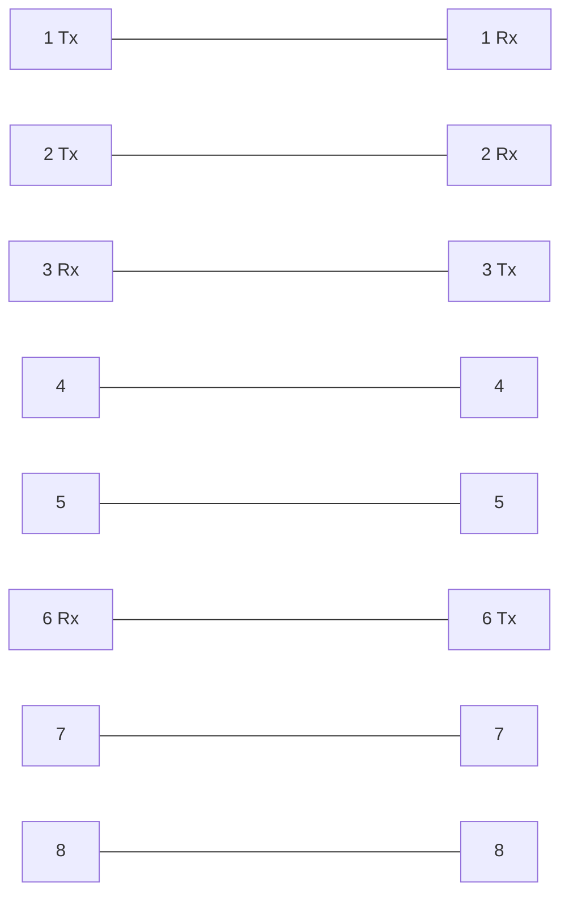

## RJ-45
### Registered Jack ports

## Ethernet
- Ethernet is a collection of network protocols and standards
- for the purpose of this lesson, we will focus on cabling defined by ethernet standards

## Network Protocols
- Network protocols give computers a **standard** way for computers to talk to eachother
- universal standard, so all computers can talk to each other
- an example of this is IP - internet protocol

### Bits and Bytes
- A bit is either a 0 or 1
- A byte is a collection of 8 bits
- All communication on a computer is composed of bits
- Sizes of bits:
	- 1 kilobit (kb) = 1,000 bits
	- 1 megabit(Mb) = 1,000,000 bits
	- 1 gigabit(Gb) = 1,000,000,000 bits
	- 1 terabit(Tb) = 1,000,000,000,000 bits
	- There are higher bits then this, but they are not used often

### Ethernet Standards
- Defined in the IEEE 802.3 standard in 1983
- IEEE = Institute of electrical and Electronics Engineers
- This defines what speeds computers can talk, and how they transmit information

|speed|Common name| IEEE standard| informal name|maximum length|
|-|-|-|-|-|
|10 Mbps|Ethernet|802.3i|10BASE-T|100 m|
|100 Mbps|fast ethernet|802.3u|100BASE-T|100 m|
|1 Gbps|Gigabit Ethernet|802.3ab|1000BASE-T|100 m|
|10 Gbps|10 Gig Ethernet|802.3an|10GBASE-T|100 m|

#### UTP cables
- The copper cables used in ethernet are Unshielded Twisted Pair cables (UTP)
- unshielded cables are vulnerable to EMI (Electromagnetic Interference)
- There are 4 pairs of cables twisted together
- Twisting these wires in pairs helps protect against EMI
- Not all ethernet standards use all 8 wires
	- 10 and 100 use only 4 wires
	- 1000 and 10G use all 8 wires

##### Full Duplex Transmission
On a UTP 10BASE-T or 100BASE-T cable, only certain pins are used. One pair Transmits (Tx) data, and the other pair recieves (Rx) data. See below

This diagram represents the two ends of a cable, with each pin being numbered. The first pair, pins 1 and 2 send data from one end and recieve on the other. The second pair, 3 and 6, does the opposite. When you are able to send and recieve data at the same time like this, it is called **Full Duplex Transmission**
Remember this:
- Routers and PC's **transmit** on pins 1 and 2, and **recieve** on pins 3 and 6
- switches are the opposite, they **recieve** on pins 1 and 2, and **transmit** on pins 3 and 6
- This works well if you are connecting a pc and router to a switch using what is called a **Straight Through Cable**
- Sometimes, you may want to connect a PC directly to a router or another PC?
	- You will have to use what is called a **Crossover Cable**. This swaps these pins so routers and switches can talk directly.

|Device Type|Tx Pins|Rx Pins|
|-|-|-|
|Router|1 and 2|3 and 6|
|Firewall|1 and 2|3 and 6|
|PC|1 and 2|3 and 6|
|Switch|3 and 6|1 and 2|

You should note that many newer devices have a feature called **Auto MDI-X**. This feature allows devices to automatically what pins are Rx and Tx and adjust accordingly.

##### 1000BASE-T and 10GBASE-T
In these standards, all 8 wires are used and all wires are **bidirectional**. There are not Rx and Tx dedicated pins. This helps them operate at faster speeds.

### SFP Transcievers
- SFP(Small Form-factor Pluggable)
- This is another common cable in networking,
- This standard only uses two wires, a single Rx and Tx wire for each direction.
- Fiber optic cables are constructed in layers
	1. The fiberglass core itself - carries data
	2. cladding that reflects light
	3. a protective buffer
	4. the outer jacket of the cable
- The two main kinds of fiber cables are **multi-mode** and **single-mode**
#### Multi-mode Fiber
- Core diameter is wider than single-mode fiber
- allows multiple angles (modes) of light waves to enter the fiberglass core
- Allows longer cables than UTP, but shorter than single-mode fiber
- Cheaper than single-mode fiber (due to cheaper LED-based SFP transmitters)
#### Single-mode fiber
- Core diameter is narrower than multimode fiber
- light enters at only a single angle(mode)
- Allows longer cables than both UTP and multimode
- More expensive than multimode fiber (due to more expensive laser transmitters)

#### Fiber Optic Cable Standards
|informal name|IEEE standard| Speed |Cable Type |Maximum Length|
|-|-|-|-|-|
|1000BASE-LX|802.3z|1 Gbps|Multimode or Single Mode|550 m (mm) or 5 km (sm)|
|10GBASE-SR|802.3ae|10 Gbps|Multimode|400 m|
|10GBASE-LR|802.3ae|10 Gbps|Single-Mode|10 km|
|10GBASE-ER|802.3ae|10 Gbps|Single-Mode|30 km|

### UTP vs Fiber-optic
|UTP|Fiber-Optic|
|-|-|
|Lower cost then fiber optic|More expensive|
|Shorter maximum distance (~100m)|Longer distance|
|Can be vulnerable to EMI|not vulnerable to EMI|
|RJ45 ports are cheapter than sfp ports|More expensive ports (multimode is less expensive then single mode)|
|Emit (leak) a faint signal outside of the cable, which could be copied (security risk)|Does not emit a faint signal|