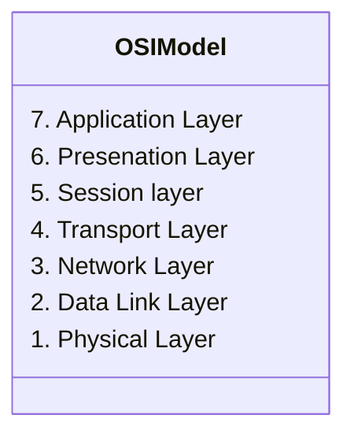
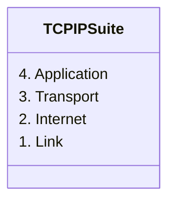

## What is a networking model?
- Networking models categorize and provide a structure for networking protocols and standards
### Protocols
- A set of rules defining how network devices and software should work
- protocols only refer to logical rules, not physical standards
### Standards
- refer to physical standards
- includes cabling, voltage, etc
## Networks without standardization
Imagine a world where Dell computers and Macs can't talk to each other. This was reality before protocols were implemented.

## OSI Model
- Open Systems Interconnection model
- a conceptual model that categorizes the different functions in a network
- Created by the 'International organization for standardization' (ISO)
- Functions are divided into 7 'layers'.
- These layers work together to make a network work

### Layers in Depth
#### The Upper layers
- Network engineers don't usually work with the top 3 layers
- Application developers work with the top layers of the OSI model to connect their applications over networks
- Data is prepared on the top 3 layers, then it gets passed to the bottom 4 layers which does the work of sending it over the network.

##### Application - layer 7
- This layer is closest to the end user
- interacts with software applications, for example your web browser
- Http and Https are layer 7 protocols
###### Functions include
- Identifying communication partners
- Synchronizing communications

How does the application layer determine communication partners? Imagine a stack. Data **starts** at the application layer and makes its way down the stack, with each layer adding something to the data. This is called **encapsulation**

By the time it gets to the bottom layer, it is an electrical signal that travels over a wire to the target destination. The data then runs back up the layer, each time with something removed. This is called **De-encapsulation**

Both encapsulation and de-encapsulation are examples of **Adjacent Layer interaction**, interaction between different layers of the OSI model. However, the interaction between these two hosts is called **Same Layer interaction**, because the target and source are both on the application layer.

##### Presentation - Layer 6
- Data in the application layer is in "application format"
- it needs to be "translated" to a different format to be sent over a network
- the Presentation layers job is to translate between application and network formats
- For example, encryption of data as it is sent, and decryption as it is recieved.
- Also translates between different application-layer formats

##### Session - Layer 5
- Controls dialogues (sessions) between communcating hosts
- Establishes, manages, and terminates connections between the local application (for example, your web browser) and the remote application (for example, youtube)
- Youtube has hundreds of thousands of sessions at a time - this layer can manage that

#### The Lower Layers

##### Transport - Layer 4
- The transport Layer adds a header in front of the data, like this:
| Data | L4 Header |
| ---- | --------- |

- Segments and reassembles data for communications between end hosts
- Breaks large pieces of data into smaller segments which can be more easily sent over a network and are less likely to cause transmission problems
- if any one data segment is lost, it has less impact on the whole with smaller segments
- provides host-to-host communication
- This combination of data is called a **segment**

##### Network - Layer 3
- the network layer adds a header in front of the L4 header, like this:
| Data | L4 Header | L3 Header |
| ---- | --------- | --------- |

- this header includes information such as source and destination IP address
- Provides connectivity between end hosts on different LANS
- provides logical IP addressing
- provides path selection between source and destination (routing)
- routers operate at layer 3
-  the combination of data, l3 header, and l4 header is called a **packet**

##### Data Link - Layer 2
- the Data link layer adds a L2 header and an L2 trailer:
| L2 trailer | Data | L4 Header | L3 Header | L2 Header | 
| ---------- | ---- | --------- | --------- | --------- |

- Provides Node-to-node connectivity and data transfer (for example, pc to switch, switch to router, router to router)
- defines how data is formatted for transmission over a physical medium (for example, copper UTP cable)
- Detects and possible corrects physical layer errors
- uses layer 2 addressing, seperate from layer 3 addressing 
- Switches operate on this layer
- The combination of L2 trailer, Data, L4 header, l3 header, and l2 header is called a **frame**

##### Physical - Layer 1
- No encapsulation takes place on this layer
- defines physical characteristics of the medium used to transfer data between devices
- For exmaple, voltage levels, transmission distances, physical connectors, cable specs, etc
- Digital bits are converted into electrical (for wired) or radio (for wireless) signals

### Encapsulation in depth

#### Upper Layers
- The Data is generated and a destination is determined

#### Transport - Layer 4
- layer 4 header is added on. This header contains **port** information
- **Segments** live on layer 4

#### Network - Layer 3
- Layer 3 header is added. This header contains **IP source and destination** information
- **Packets** live on layer 3

#### Data Link - Layer 2
- Layer 2 header and trailer is added. This header contains information like **source and destination MAC address and a checksum for the packet**
- **Frames** live on layer 2

#### Physical - Layer 1
- No encapsulation takes place on this layer

### PDU
A PDU is a Protocol Data Unit. it is the term to refer to the data structure on each layer
- Data is an upper layer PDU
| data |     | 
| ---- | --- |
-  Segment is a Layer 4 PDU
| Data | L4 Header | 
| ---- | --------- |
- Packet is a Layer 3 PDU
| Data | L4 Header | L3 Header | 
| ---- | --------- | --------- |
- Frame is a Layer 2 PDU
| L2  | Data | L4 Header | L3 Header | 
| --- | ---- | --------- | --------- |
- A bit is a Layer 1 PDU

## All People Seem To Need Data Processing

## TCP/IP Suite
- Conceptual model and set of communication protocols used in the internet and other networks
- Known as TCP/IP because those are two of the foundational protocols in the suite
- Developed by the US DOD through DARPA
- Similar structure to the OSI Model, but less layers
- this is the model actually in use in modern networks
- Note that the OSI model is still influential to engineers today, so its important to learn it. 
The TCP/IP model is as follows:

- The Application, Presentation, and Session models are combined into the **Application layer**
- Both share the **Transport Layer
- The Network layer maps to the **Internet Layer**
- The data Link layer and physical layer map to the **Link Layer**
