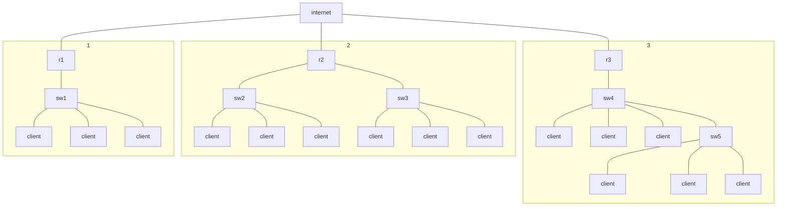
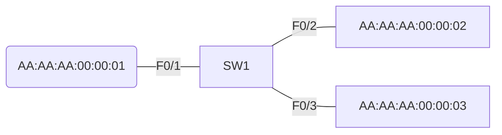
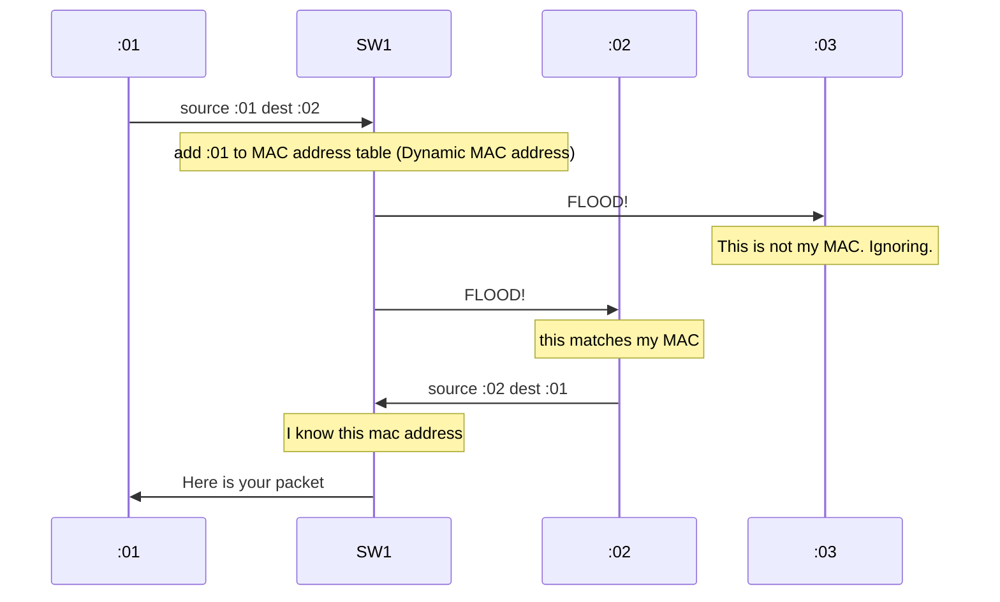
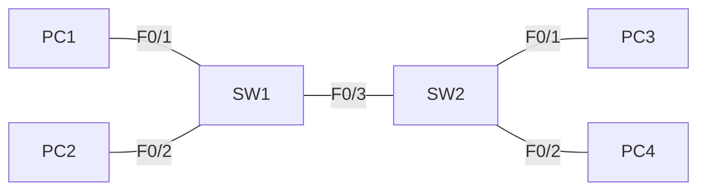
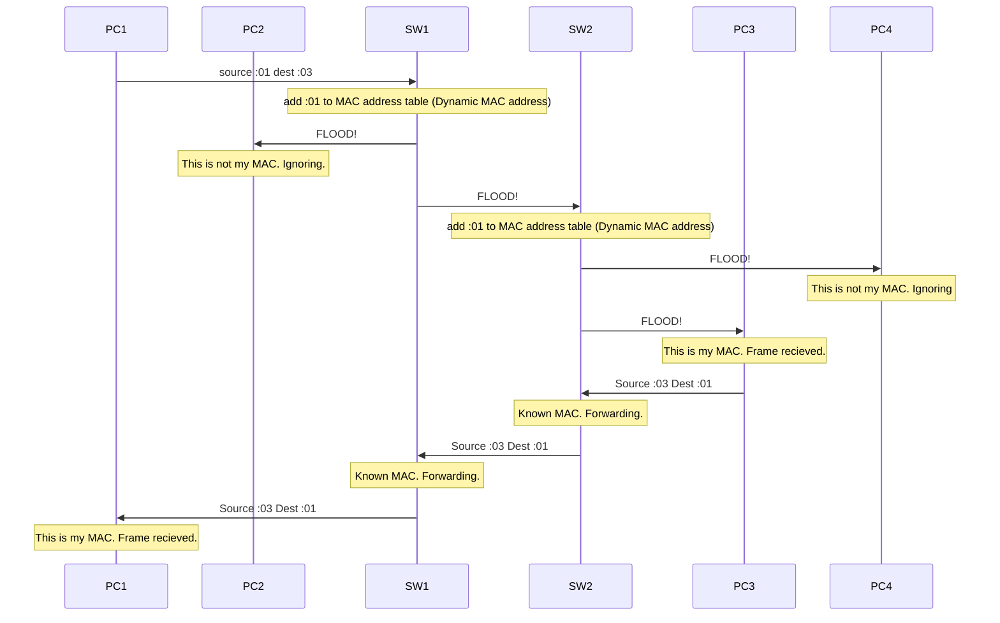

## Local Area Networks (LANS)
### What is a LAN?
A Lan is a network contained to a small area, such as one office floor or a home office. 
#### How many LANS?
Consider the following network diagram:

How many LANS are in the diagram above?
The answer is 4!
Subgraph 1 and 3 are clear, they have 1 LAN each. Subgraph 2 actually has 2 LANS. Because each switch is coming off a **different router interface**, that means that these are **seperate LANS**

---
## Ethernet Frames
This is an ethernet Frame:
| Eth Header | Packet | Eth Trailer | 
| ---------- | ------ | ----------- |

### Ethernet Header
Lets take a closer look at the ethernet Header:
| Preamble | SFD (Start frame delimiter) | Destination | Source  | Type (or length) |
| -------- | --------------------------- | ----------- | ------- | ---------------- |
| 7 bytes  | 1 byte                      | 6 bytes     | 6 bytes | 2 bytes                |

Try to remember the size of each of these header elements!
#### Preamble
- Length: 7 bytes (56 bits)
- Alternating 1's and 0's
- 10101010 * 7
- This allows devices to synchronize their reciever clocks to the incoming frame
#### Start Frame Delimiter (SFD)
-  Length: 1 byte (8 bits)
- 10101011
- indicates the end of the preamble and beginning of the rest of the frame
#### Destination & Source
- Indicates the devices sending and recieving the frame
- Consists of destination and source MAC address
- MAC = Media Access Control
- MAC is a 6 byte (48 bit) address of a physical device
#### Type or Length
- 2 bytes (16 bit) field
- a value of 1500 or less in this field indicates the **LENGTH** of the encapsulated packet
- A value of 1536 or greated indicates the **TYPE** of encapsulated packet (usually ipv4 or ipv6) and the length is determined via other methods
### Ethernet Trailer (FCS)
The Ethernet Trailer has only one field: 
| FCS |     |
| --- | --- |
| 4 bytes    |     |
This is the **Frame Check Sequence**. It is used by the recieving device to check for errors in transmission
- 4 bytes (32 bits)
- Detects corrupted data by running a '**CRC**' algorithm over the received data
- CRC =  Cyclic redundancy check
- don't worry about this too much, just be familiar with the term and purpose

### Sizes of headers and trailers
Lets look at the header  diagram again:
| Preamble | SFD (Start frame delimiter) | Destination | Source  | Type (or length) |
| -------- | --------------------------- | ----------- | ------- | ---------------- |
| 7 bytes  | 1 byte                      | 6 bytes     | 6 bytes | 2 bytes                |

The total bytes is equal to 20

And the trailer:
| FCS |     |
| --- | --- |
| 4 bytes    |     |

The total bytes is equal to 4

Finally, here is the complete frame:
| Eth Header | Packet | Eth Trailer |
| ---------- | ------ | ----------- |
| 20 bytes   |        | 4 bytes     |

The total bytes of the header and trailer is equal to 24

## Mac Address
- 6 byte (48 bit) physical address assigned to the device when it is made
- A.K.A 'Burned in Address' (BIA)
	- I've never heard anyone say this
- Is globally unique
- The first 3 bytes are the OUI (organizationally unique identifier), which is assigned to the company making the device
- The last 3 bytes are unique to the device itself
- written as 12 hexadecimal characters
Consider the following Diagram:

Here we have three PC's, represent by their mac address, connected to a switch. Because the first half of these are identical, this means these three are from the same manufacturerer. 

### Unicast Frame
Lets imagine device :01 wants to send a frame to :02. because this frame has only a single destination, it is known as a **unicast** frame. First, PC1 sends out a frame with the source header as its own MAC and the destination as PC2's mac.

1. the frame is sent from :01's NIC to the switch. It looks at the source MAC address and lears where PC1 is. 
2. When SW1 recieves this frame, it adds :01 to its mac address table and associates that mac address with it's interface. This is known as **Dynamically learned MAC address** or **Dynamic MAC address** because the switch learned it itself. All switches keep a mac table like this, and they fill it by dynamically looking at the source mac of frames it recieves. This is a very important concept, so remember it.
3. Now we have a problem. The frames destination is :02, but the switch doesn't know where that is yet. This is called an **Unknown Unicast Frame**. This is whats it called when the switch recieves a packet that has a destination that is still unknown. The switches only option is to **flood** the interfaces. In other words, the switch is going to forward this frame out of all of its interfaces! 
4. It pushes the frame to both :02 and :03. :03 ignores this frame because it's MAC address does not match. PC2 however, recieves the packet and processes it as intended.
5. :02 decides it wants to reply, so it sends a frame back to :01 via SW1
6. SW1 looks at the source of the frame, and can add it to its MAC Address Table. This time, because :01 has a known address, this is a **Known Unicast Frame**. Rather then **flooded**, these frames are **forwarded**. SW1 can simply send the frame directly to its destination. 

#### An example
Let us use the following diagrams to visualize this process:
| MAC | Interface |
| --- | --------- |
| :01 | F0/1      |
| :02 | F0/2          |

#### Another Example
Consider the following diagram:

note for simplicity, PC1 will be :01, pc2 will be :02. etc.
1. PC1 wants to Send a switch to PC3. the last bytes of the MACS are :01 and :03. The Packet arrives at SW1
2. SW1 learns :01s Mac address and adds it to its MAC address table. Once again, this is a **Dynamic MAC address**
3. SW1 does not know where :03 is. This is an **Unknown Unicast Frame**. It **floods** on all interfaces except the recieving one.
4. PC2 drops this frame as the dest MAC does not match its own MAC
5. SW2 Recieves the Frame. It uses the Source MAC address to learn :01's mac and add it to its MAC address table.
6. SW2 does not know where :03 is. It **Floods** all interfaces, except the one it was recieved on. 
7. PC4 drops the frame, because it does not match its MAC
8. PC3 accepts the frame
9. PC3 sends a reply. The reply is recieved by SW2
10. SW2 checks its MAC address table. It knows :01 is on F0/3 it **forwards** this frame. this is a **Known unicast**
11. SW1 recieves the frame. it checks its MAC address table. It knows :01 is on F0/1 it **forwards** this frame. This is a **known unicast**
12. PC1 recieves the frame.

#### A note on Dynamic MAC addresses
On cisco devices, Dynamic MAC addresses are removed from the table after **5 minutes** of inactivity.  