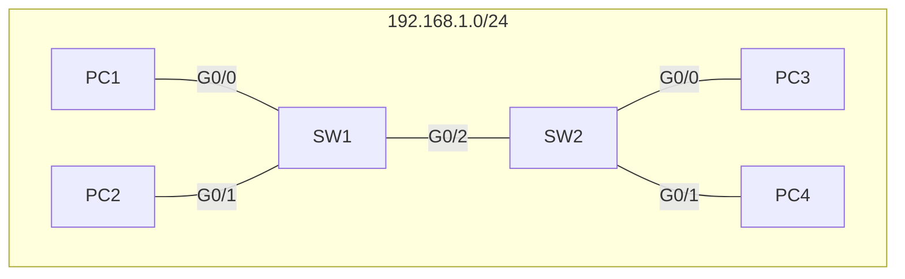

## A bit on frames 
- the preamble and SFD is not usually considered as part of the ethernet header, though it is sent with every frame. 
- Therefore, the size of the ethernet header and trailer isactually 18 bytes, if you don't include the preamble and SFD
- There is a minimum size for an ethernet frame, which is **64 bytes**, including the encapsulated payload.
- 64 - 18 is **46 bytes**. This means the minimum payload size is 46 bytes. 
### What if we need to send a smaller payload then 46 bytes?
In this case, **padding bytes** are added. These bytes are all 0's

## Ethernet LAN switching
The last lesson was a simplification. In reality, when frames are sent, they don't just include source and destination MAC, they also include source and destination IP address. This information is contained in the **packet**, which is encapsulated in the frame.
### An example
Consider the following diagram. This is the same as the diagram from Section 6, with some modifications. 
1. We have changed the interfaces from fast ethernet (**fx/x**) to Gigabit ethernet (**Gx/x**)
2. we have assigned the IP range of 192.168.1.0/24 to this network
3. we are now using more realistic MAC addresses. 
| MAC               | IP address | Client |
| ----------------- | ---------- | ------ |
| OC:2F:B0:11:9D:00 | .1         | PC1    |
| 0C:2F:B0:84:62:00 | .2         | PC2    |
| 0C:2f:b0:1e:39:00 | .3         | PC3    |
| 0C:2f:b0:1e:0A:00 | .4         | PC4    | 

Imagine that PC1 wants to send out a frame to PC3. The source and dest information will look like this:


```Src IP: 192.168.1.1
Dst IP: 192.168.1.3
Src MAC: 9D:00
Dst MAC: ?
```
The user entered the IP addr Dst, but PC1 has to discover PC3's MAC by itself. Remember that switches are **Layer 2** devices and do not operate on layer 3. Therefore they do not use IP addresses, but MAC addresses.
In order for PC1 to learn PC3's MAC address, it uses a protocol called **ARP**
#### ARP
- ARP is **Address Resolution Protocol**
- ARP is ues to discover the Later 2 address (MAC address) of a known Layer 3 address (IP address)
- This consists of 2 messages:
	1. ARP request
	2. ARP reply
- **ARP Request** is **broadcast** = Sent to all hosts on the network
- **ARP reply** is **Unicast** = Sent to only one host. (The host that sent the request)
#### Example cont.
Now that we understand ARP, we can return to our example. Recall this frame:
```
Src IP: 192.168.1.1
Dst IP: 192.168.1.3
Src MAC: 9D:00
Dst MAC: ?
```

Before we can send this frame, we need to send an ARP request. The arp request appears as follows:
**ARP REQUEST**:
```
Src IP: 192.168.1.1
Dst IP: 192.168.1.3
Src MAC: 0C:2F:B0:11:9D:00
Dst MAC: FF:FF:FF:FF:FF:FF
```
note that the dst MAC is repeating F's. this is the **broadcast MAC address**. This is used when a device wants to send ethernet frames to all devices on the LAN. 

Lets go through the steps. 
1. PC1 sends an ARP request which is recieved by SW1
2. SW1 then learns PC1's MAC as a **Dynamic MAC address** and adds it to the MAC address table.
3. SW1 sees the target as FF:FF:FF:FF:FF:FF, so it knows to **broadcast** this frame. It sends the frame out of all interfaces except the recieving one.
4. PC2 knows its IP addr does not match the src IP. so it ignores the request.
5. SW2 recieves the ARP req. it adds PC1s MAC as a **Dynamic MAC address** and adds it to the MAC address table.
6. SW4 sees the target as FF:FF:FF:FF:FF:FF, so it knows to **broadcast** this frame. It sends the frame out of all interfaces except the recieving one.
7. PC4 knows its IP addr does not match the src IP. so it ignores the request.
8. PC3 recieves the request and aknowledges that its MAC and IP match the request
9. PC3 now knows PC1's MAC and IP 
10. PC3 Sends the frame to SW2
11. SW2 learns PC3's MAC. it already knows PC1's MAC, so it will forward this frame
12. SW1 recieves this frame.
13. SW1 learns PC3's MAC. It already knows PC1's MAC, so it will forward this frame
14. PC1 recieves the ARP reply.

### ARP Table
Lets look at an example of an ARP table from windows. This is only a portion of the ARP table.
```
>arp -a

Interface: 10.2.5.37 --- 0x11
  Internet Address      Physical Address      Type
  10.2.1.30             34-9f-7b-59-c4-1c     dynamic
  10.2.1.42             00-21-b7-77-e5-6e     dynamic
  10.2.1.43             00-21-b7-f7-d1-33     dynamic
  10.2.1.45             00-21-b7-77-35-67     dynamic
  10.2.1.47             78-8c-77-8c-42-38     dynamic
  10.2.1.48             78-8c-77-8c-42-c9     dynamic
  10.2.1.49             78-8c-77-8c-b6-72     dynamic
  10.2.1.50             78-8c-77-8c-ce-10     dynamic
  10.2.1.51             78-8c-77-8c-4e-d6     dynamic
  10.2.1.52             00-21-b7-bd-dd-92     dynamic
  10.2.1.53             34-9f-7b-59-5e-57     dynamic
  10.2.1.57             b4-22-00-38-0a-85     dynamic
  10.2.1.254            ac-1f-6b-83-34-51     dynamic
  10.2.2.4              50-9a-4c-70-0d-db     dynamic
  10.2.2.7              00-0c-29-2f-04-9b     dynamic
  10.2.2.8              00-0c-29-05-ab-cd     dynamic
```
To view the arp table on windows, mac, or linux, you can use the command **arp -a**.
This displays a few things.
- Internet address column - IP addresses
- Physical Address column - MAC
- Type
	- static - Default entry
	- dynamic - learned via ARP
in cisco iOS you can use **show arp**
## Ping
What is ping?
- Ping is a network utility that tests reachability.
- Measures round-trip time
- uses two messages
	- ICMP echo request
	- ICMP echo reply
- One difference between ping and ARP is that ping must have a destination MAC address. Therefore, an ARP request may be required first.
## MAC address table
on a Cisco machine, use **show mac address-table** to see a MAC table

This table will show the **vlan**, **mac address**, **type**, and **ports**
Remember, these MAC addresses undergo **aging**, in other words, they will be removed from the table after 5 minutes.

You can also remove MAC addresses manually, by using the command **clear mac address-table dynamic** to clear all dynamic MAC addresses

you can also use **clear mac address-table dynamic address *mac-address*** to clear MACs by address

You can also use **clear mac address-table dynamic interface *interface*** to clear a specific interfaces MAC addresses.