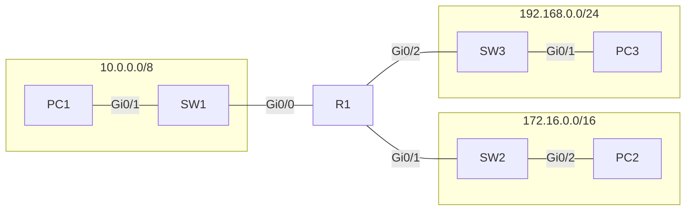

 c## IPv4 classes
### Review and clarification
Consider the chart from last video:
| class | First octet | First Octet Numeric Range |
| ----- | ----------- | ------------------------- |
| A     | 0xxxxxxx    | 0-127                     |
| B     | 10xxxxxx    | 128-191                   |
| C     | 110xxxxx    | 192-223                   |
| D     | 1110xxxx    | 224-239                   |
| E     | 1111xxxx    | 240-255                          |
Lets introduce another chart:

| class   | Leading bits | Size of **Network Number** bit field | size of **rest** bit field | number of networks  | addresses per network |
| ------- | ------------ | ------------------------------------ | -------------------------- | ------------------- | --------------------- |
| Class A | 0            | 8                                    | 24                         | 128(${2^7}$)        | 16,777,216($2^{24}$)  |
| Class B | 10           | 16                                   | 16                         | 16,384($2^{14}$)    | 65,536($2^{16}$)      |
| Class C | 110          | 24                                   | 8                          | 2,097,152($2^{21}$) | 256($2^8$)            |

The **addresses per network** field includes the broadcast and network address, not just usable addresses.

#### Class A
remember that the range of class A addresses really only goes up to 126, because 127 is reservered for **loopback addresses?** well, the range of 0 is also reserved, so really the usable range of class A is 1-126.
## Finding important Items
### Max Hosts
Lets imagine a class C network, 192.168.1.0/24. This means only the last octet can be used for hosts. This gives us a value of 255.
However, remember that two addresses are always reserved. So the usable addresses are actually **two less then max addresses**.
The max hosts on a class C network is $256-2=254$

as another example, lets look at a class B network.
172.16.0.0/16 -> 172.16.255.255
As before, 2 addresses are reserved, so the max hosts is equal to $65536-2=65534$

$**2^n-2=Maximum hosts**$

### Network Address
Network address is always the **first IP address in a network**
### Broadcast address
Broadcast address is always the **last IP address in a network**
### First usable address
Increment Network address by 1
### last usable address
Decrement Broadcast address by 1
## Configuring IP addresses on cisco devices
Consider the following network diagram:

We will assign the last usable address to each interface on the router, 10.255.255.254, 172.16.255.254, and 192.168.0.254.
We will assing the first usable interface to each PC. 10.0.0.1, 172.16.0.1, and 192.168.0.1

### Making the configurations
In the interface, you can use the comman **en** to enter exec mode, then use **show ip interface brief** or **sh ip int br**to see: 
- list of interfaces, 
- assigned IP addresses, 
- method tells how the IP is set. 
- Status tells whether an interface is up or not. Administratively down is the default status of router interfaces. 
- Protocol indicates the layer 2 status. 

in global configuration mode, use **interface gigabitethernet 0/0** to start working with this gi0/0. 
you can use the shortcut **in** instead of typing interface
you can use the short version og **g0/0** instead of gigabitethernet

use command **ip address x** to set the ip address. you need to add the subnet mask, for example:
ip address 10.255.255.254 255.0.0.0

Then, use the command **no shutdown** or **no shut** to enable the interface.

