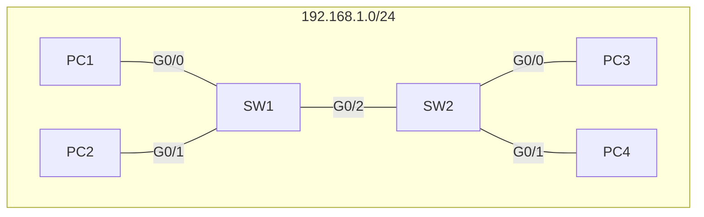
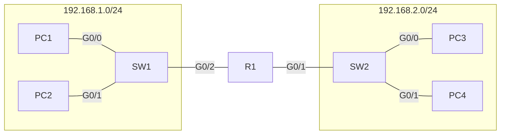

In this lesson, we will look not at how traffic is moved within a LAN, but instead how traffic is moved between LANS.

## The Network Layer
Lets review the network layer:
- This layer provides connectivity between end hosts on *different* networks (i.e, outside of the LAN)
- **This provides logical addressing, or IP addresses**
- provides path selection between source and destination, or **routing**
- Routers operate at this layer.

## Routing
### LAN IP addressing
consider the following network:

These computers are all on the same network, or the same LAN. The two switches do not seperate networks, they connect and expand networks. You could add 2 more switches and they would all still be on the same LAN. Because of this, all of these computers are in the same layer 3 network, with an IP range of 192.168.1.0/24. When a broadcast frame is sent with a dest MAC of FF:FF:FF:FF:FF:FF, it will be sent to all computers in this LAN, or layer 3 network.

### Two LANS
Now, lets take the above diagram and add a **router** between SW1 and SW2. Lets imagine that SW2, PC3, and PC4 are now on the 192.168.2.0/24 network:

You may notice that in these networks, the first three octets (192.168.x) represent the network itself, and only the last number represents hosts. 
The number after the / tells us which groups of numbers represent the **network**, and which group of numbers represents the **hosts**. 
#### Router IP addressing
in the above network, the router actually needs **two** IP addresses, one for each interface that the LAN is on. Lets make the LAN1 interface .1.254, and the LAN2 interface .2.254

Lets imagine PC1 sends an ARP request. 
1. PC1 sends ARP request
2. SW1 recieves the frame
3. PC2 and R1 recieves the frame
However, this is where it ends. **Broadcast frames do not leave the LAN.**

## IPv4 header
Lets look at the IPv4 header. 
![[Pasted image 20230308133404.png]]
There are a lot more sections in this header then there were in the ethernet header. For now lets just look at source and destination address.
### Source and Destination Address
Firstly, note that both the source and destination address are 32 bits in length. This means IP addresses are **32 bits (4 bytes)** in length
#### anatomy of an IP address
lets look at an example IP. 192.168.1.254. Note that each octet represents 8 bits.
if we write them out as binary it will look like this:

192.168.1.254 = 11000000 10101000 00000001 11111110

Binary is difficult to read and understand for humans, so we represent them with **dotted decimal**, which is seperated with periods.

#### Decimal and Hexadecimal
Lets compare the same number written in different base formats:
Decimal (Base 10) = 3294 = 3x1000 + 2x100 + 9x10 + 4x1 
Hexadecimal (Base 16) = CDE = Cx256 + Dx16 + Ex1 = 12x256 + 13x16 + 14x1 = 3072 + 208 + 14 = 3294

with that refresher, lets look at a binary number:
192 = 11000000
really, an IP address is a series of 32 bits divided into octets, written as a decimal number to make it easy for humans to understand. However, you may remember the / at the end of the IP address:
192.168.1.254/24
This number means that the **first 24 bits** represent the network portion of this IP, and the last 8 represent the host.

## IPv4 Address Classes
IP addresses are divided into **classes**. Look at the table below:
| class | First octet | First Octet Numeric Range |
| ----- | ----------- | ------------------------- |
| A     | 0xxxxxxx    | 0-127                     |
| B     | 10xxxxxx    | 128-191                   |
| C     | 110xxxxx    | 192-223                   |
| D     | 1110xxxx    | 224-239                   |
| E     | 1111xxxx    | 240-255                          |

The class of an IP address is determined by the first octet of the address. If the first octet begins with 0, it means the first octet has to begin with 0-127.
The second Class is class B, because its first octet begins with 10, the octet must be between 128-191, and so on.
Here, we will focus only on class A, B, and C

Class D addresses are multicast only. We will discuss them later. 
Class E addresses are reserved, and will not be discussed in this course. 

as an additional note about class A addresses: the range of the first octet is generally considered to be 0-126, not 127. The reason for this is because the 127 range is reserver for loopback addresses. 
### Loopback addresses
- addresses within the range of 127.0.0.0 - 127.255.255.255 are loopback addresses
- these are used to test the 'network stack' on the local device.
- All addresses in this range point back to the host computer. 
### IPv4 Classes Cont
Lets look at the chart again, but with some different information:
| class | First octet | First Octet Numeric Range | Prefix Length |
| ----- | ----------- | ------------------------- | ------------- |
| A     | 0xxxxxxx    | 0-127                     | /8            |
| B     | 10xxxxxx    | 128-191                   | /16           |
| C     | 110xxxxx    | 192-223                   | /24           | 
Here we've added the **prefix length**. This is used to identify the network portion of the addresses.
In class A, there are few network addresses. However, because the host portion is very long, there are many possible hosts. Compare this with class C, where there are few hosts, but many possible network addresses.

another way of putting it is this: **the prefix length is equal tom the network number field in bits**. 

### Network address and broadcast address
Every network usable addresses are subtracted by two. this is because the first IP address in the network (.0) is the **network address**, it represents the network, so can't be assigned to a host. The last IP address in a network (.255) is the **broadcast address**, and is used to send traffic to all hosts on a network.

If the host portion of the address is **all 0's**, its a network address
if the host portion of the address is **all 255's (all 1's in binary)** , its a broadcast address.

### Netmask
using a / is not the only way to denote the prefix length. This can also be written as a **netmask.** In netmask notation, the bits that are used for network addresses are denoted in dotted decimal format. For example:
| prefix length | subnet mask   |
| ------------- | ------------- |
| /8            | 255.0.0.0     |
| /16           | 255.255.0.0   |
| /24           | 255.255.255.0 |

in the first example, because the first **8 bits** are used for the network number, the subnet mask takes up the first 8 bits: 255.0.0.0

